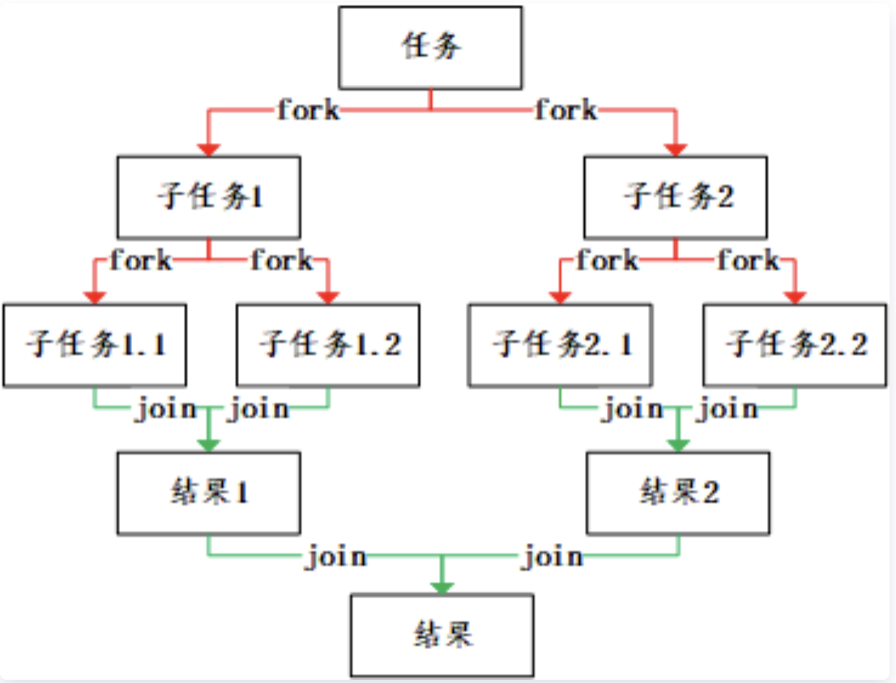

# HelloForkJoinPool（一）—— 介绍和使用

> 好久没发了呀，看了下公众号里的记录，上一次文章是在 2020年09月17日 发的，不知不觉已经鸽了一年多了，这一年除了在 HelloGitHub 上发了一个关于 ZooKeeper 系列文章以外，就是工作上的变动了，Orz
>
> 可能大家看到这篇文章的第一反应应该是：什么，我竟然还关注过这个公众号，赶紧取关了，别别别，请高抬贵手
>
> 最后还是感谢大家的关注，但我的更新肯定是随缘了

废话说完了，进入正题：

看到标题你是不是


ForkJoinPool ? 什么玩意，我好像听也没听过，但是你一定听过 ThreadPoolExecutor，这个是 Java 标准库中著名的线程池对象，也是 Java 面试中的重点对象。而我今天要谈论的 ForkJoinPool 就是 ThreadPoolExecutor 的兄弟，也算线程池，但是实现原理上要复杂的多。为了节约大家时间，我还是把丑话说在前面：

- ForkJoinPool 在工作中我都没使用过，本篇文章存粹是出于兴趣研究的，如果你想要的是能在工作中使用的干货，可以直接左上角了
- 既然没用那我学这玩意干嘛？卷死那帮面试官！

`ForkJoinPool` 我自己尝试阅读过好几次，都是以失败告终，这次是下了决心认认真真，反反复复啃了下来，我对我总结的内容还是有信心的

---

这次的 `ForkJoinPool` 我打算分三部分：

1. 介绍 `ForkJoinPool` 以及如何去使用
2. 介绍 `ForkJoinPool` 原理（尽量不涉及源码）
3. 阅读源码时需要注意的地方

最后当你看到这篇文章的时候，我其实都已经写完了，保证不会鸽，请放心食用～

我本地阅读的源码版本是（唉，一万年的 8 版本）

```bash
$ java -version
java version "1.8.0_301"
Java(TM) SE Runtime Environment (build 1.8.0_301-b09)
Java HotSpot(TM) 64-Bit Server VM (build 25.301-b09, mixed mode)
```


## 一、ForkJoinPool 是什么？

`ForkJoinPool` 位于著名的 `java.util.concurrent` JUC 包下，是 jdk 标准库的一部分，只要你安装了 jdk，那这个工具就是直接安装好的。

首先 `ForkJoinPool` 是一个普通的 `class` 和上文中的 `ThreadPoolExecutor` 算是兄弟关系，因为它们都是 `AbstractExecutorService` 的子类

```java
public class ForkJoinPool extends AbstractExecutorService implements ExecutorService {
  	...
}
public class ThreadPoolExecutor extends AbstractExecutorService implements ExecutorService {
  	...
}
```

而 `ExecutorService` 则是 jdk 中对于**执行任务的行为**的接口定义，具体怎么执行其实还是看具体的 class 实现了，而上面的两种 class `ForkJoinPool` 和 `ThreadPoolExecutor` 则都是采用的使用**线程**的方法，所以 `ForkJoinPool` 可以认为就是一个**线程池**，通过创建和复用线程对象达到来并发执行任务，提高程序性能的目的。

## 二、ForkJoinPool 怎么用？

### 2.1 创建 ForkJoinPool

Java 中使用任意对象的方法肯定是先要创建该对象，那我们可以看看 `ForkJoinPool` 的几个公开的构造器

```java
// 构造器1
public ForkJoinPool() {
    ...
}
// 构造器2
public ForkJoinPool(int parallelism) {
		...
}
// 构造器3
public ForkJoinPool(int parallelism,
                        ForkJoinWorkerThreadFactory factory,
                        UncaughtExceptionHandler handler,
                        boolean asyncMode) {
 		...
}
```

看到参数其实有 4 个

- 并行度（默认是当前计算机的 CPU 逻辑核数，我的 Macbook Pro 是 8 核的，8 个物理核，每个物理核是 2 个逻辑核，所以对于我的 MBP 来说，默认是 16）
- `ForkJoinPool` 和一般线程池不一样的地方就在于它使用的线程对象必须是 `ForkJoinWorkerThread`，所以对应需要一个创建该线程的工厂 `ForkJoinWorkerThreadFactory` 的具体实现，默认是 `ForkJoinPool` 帮我们已经实现好的 `DefaultForkJoinWorkerThreadFactory`
- 异常处理 `UncaughtExceptionHandler` 的接口实现，默认为空
- 是否异步模式，默认是同步（具体异步和同步有什么区别及如何去实现的之后再说）

所以通过观察构造器，我们可以看到其实 `ForkJoinPool` 一般就是这么用：

```java
ForkJoinPool pool = new ForkJoinPool();
// or
ForkJoinPool pool = new ForkJoinPool(8);
```

### 2.2 将任务提交到 ForkJoinPool 中

有了创建好的线程池对象之后，就可以使用了，对于线程池对象我们一般有两种方法来使用：

```java
pool.execute(/*一个 Runnable 任务对象*/);
Future future = pool.submit(/*一个 Callable 任务对象*/);
```

`Runnable` 和 `Callable` 对象的区别就是**无返回值**和**有返回值**，大家都已经很熟悉了，但对于 `ForkJoinPool` 来说还有一种特殊的任务对象是 `ForkJoinTask`，该对象也是可以使用 `submit` 方法的

```java
ForkJoinTask forkJoinTask = pool.submit(/*一个 ForkJoinTask 对象*/);
```

上面的 `Future` 和 `ForkJoinTask` 都是带泛型的，所以这两类任务是可以有返回值的。

而 `ForkJoinTask` 由于自身需要实现的方法有 3 个，对于使用来说不太友好，所以 jdk 本身已经提供了两个抽象程度更高的 `ForkJoinTask` 的子类实现：`RecursiveAction` 和 `RecursiveTask` 也是分别对应**无返回值**和**有返回值**，所以对于应用来说直接去继承这两个子类并实现 `compute` 方法即可。

在我个人观点中，如果你的任务不需要返回值的话，那完全可以使用 `ThreadPoolExecutor`，根本不需要使用这个 `ForkJoinPool`，所以下面给出一个带返回值的简单示例（省略 `import` 及其他非必要展示的语句）

### 2.3 完整示例

我们这里还是使用**求和（1 至 1 亿 累加）**作为展示 `ForkJoinPool` 使用的示例，在这之前我们先看看单线程中使用循环是怎么写的

```java
long sumResult = 0;
for (int i = 1; i <= 100000000; i++) {
		sumResult += i;
}
System.out.println("单线程累加值：" + result); // 答案：5000000050000000
```

那如果要用 `ForkJoinPool` 要怎么实现呢？

首先我们先要定义执行的任务对象，因为我们求和是需要**有返回值**的，所以继承 `RecursiveTask` 并且将泛型指定为 `Long`（这里因为是演示，长整型肯定是足够的，更严谨的应该是使用 `BigDecimal` 或 `BigInteger`，取决于是否有小数），任务对象定义如下：

```java
public class SumTask extends RecursiveTask<Long> {
  
		private final int start;
    private final int end;
		/**
		 * 需要在构造该任务对象的时候，就告知求和的起点和终点分别是什么数，所以定义在构造器中
		 */
    public SumTask(int start, int end) {
        this.start = start;
        this.end = end;
    }
  	
  	/**
  	 * 最重要的方法，该方法中就是具体的业务逻辑实现
  	 *
  	 */
  	@Override
    protected Long compute() {
        if (end - start <= 50) {
          	// 如果起止位置相差小于等于 50，则直接使用循环求解，并返回
            long result = 0;
            for (int i = start; i <= end; i++) {
                result += i;
            }
            return result;
        } else {
          	// 如果起止位置大于 50，将任务拆分，这里演示的是拆分成两个子任务（其实可以拆分成任意数量的）
            int middle = (start + end) / 2;
          	// 创建两个子任务
            SumTask firstTask = new SumTask(start, middle);
            SumTask secondTask = new SumTask(middle + 1, end);
          	// 通过 invokeAll 将多个子任务提交
            invokeAll(firstTask, secondTask);
          	// 或者手动调用 fork 方法，下面两行是用来替代 invokeAll 那一行的
            // 但这样的写法是不推荐的，之后会解释
          	// firstTask.fork();
          	// secondTask.fork();
          	// 使用 join 方法等待，子任务的返回
            return firstTask.join() + secondTask.join();
        }
    }
}
```

测试 main 方法

```java
public static void main(String[] args) {
		ForkJoinPool pool = new ForkJoinPool();
  	ForkJoinTask<Long> task = pool.submit(new SumTask(1, 100000000));
  	// 输出 5000000050000000
  	System.out.println("fork 循环计算  累加值：" + task.join());
}
```

`ForkJoinPool` 高效的思路就是将一个个任务拆分成子任务，最后再合并，我这里借用一张网上的图



## 三、总结

- `ForkJoinPool` 是 jdk 已经实现的一个线程池对象，可以提交任务至线程池
- 通过实现 `ForkJoinTask` 的 `compute` 方法来自定义拆分合并子任务的逻辑，拆分通过 `fork` 或  `invokeAll` 方法，合并通过 `join` 方法

第一篇文章我简单介绍了 `ForkJoinPool` 线程池，下一篇开始就进入原理篇了，既然讲原理，我希望大家还是可以有一点前置的知识储备的，至少得知道 CAS 是什么，感谢！

在进入原理篇前大家可以问问自己几个关于 `ForkJoinPool` 问题：

- 如何启动线程对象
- 如何复用线程对象
- 如何保证并发安全
- 如何拆分和合并任务

那我们下一篇再见吧～


