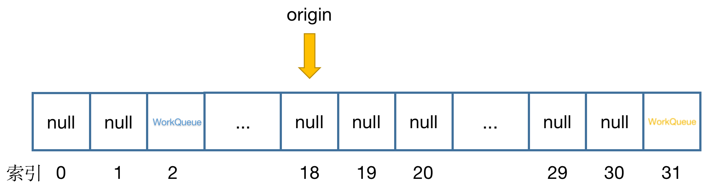

# HelloForkJoinPool（二）—— 简单流程原理概述

这一篇我们就要开启 `ForkJoinPool` 原理的讲解了，过程中我还是会尽量不讲源码的方式来陈述整个原理。让我们开始吧～


## 一、ForkJoinPool 概览

我来先入为主给大家一个感性的认识，`ForkJoinPool` 本身其实是一个数组，像这样：


数组的创建是需要一个固定长度的，那这个 `workQueues` 的初始化长度是多少呢？还记得我们上一篇中提到的构造器中的**并发度参数**吗？

```java
ForkJoinPool pool = new ForkJoinPool();
// or
ForkJoinPool pool = new ForkJoinPool(8);
```

之前也说了如果是无参构造的话，会使用当前计算机的 CPU 核数，以我的 MBP 为例是 16，那这个数组初始化的长度是多少呢？

| 并发度参数 | 数组初始化长度 |
| ---------- | -------------- |
| 1～2       | 4              |
| 3～4       | 8              |
| 5～8       | 16             |
| 9～16      | 32             |
| 17～32     | 64             |
| ...        | ...            |

从表中可以看到是找到并发度参数最近的 2 的幂次方的数，然后再乘以 2。

但是这个数组并不会在创建完 `ForkJoinPool` 后就初始化，而是要延迟到第一次任务提交的时候再初始化。

那 `workQueues` 数组中的每一项又是什么呢？其实每一项也是一个数组，还记得我们上一篇说的 `ForkJoinTask` 的吗？而这个数组中的每一项就是这个 `ForkJoinTask` ！

如果我们放大一个 `workQueues` 的索引像这样：


那这个 `array` 数组的初始化长度是多少呢？答案是：8192。这就是代码中写死的长度

```java
static final int INITIAL_QUEUE_CAPACITY = 1 << 13; // 8192
```

这个数组 `array` 和 `workQueues` 一样也是延迟初始化的，所以这个数组并不会被一开始就创建出来，一样也是等到第一个任务提交之后。

那两次提到了“任务提交之后”，那提交任务是怎么回事呢？别急在这之前我还是想先聊聊关于 `workQueues` 的设计，狗叔（JUC 大名鼎鼎的 Doug Lea，学 Java 的应该都知道吧）将这个数组一分为二，分成了**奇数**部分和**偶数**部分，所有我们通过比如 `submit` 方法提交的任务都会被放到**偶数**部分，也就是 `workQueues` 的索引 0、2、4、6、8 等等的位置。步骤大概是这样的：

- 每一个线程在使用 `ForkJoinPool` 时会被分配一个线程本地的随机数字，这个数字你可以认为不同线程是不同的，或者相同的概率很低，总之就是一个随机数字 `PROBE`
- 之后使用这个 `PROBE` 加上一个位运算的小算法，来得到一个合法的偶数索引

那**奇数**部分呢？我之后再聊～

## 二、第一次提交任务

好了，让我们再把时间拨回去，现在我们通过构造器创建了一个 `ForkJoinPool`，之后通过 `submit` 方法提交了一个任务A ，像这样：

```java
ForkJoinPool pool = new ForkJoinPool();
pool.submit(/*任务A*/);
```

由于 `workQueues` 数组是延迟创建的，会由第一个提交任务的线程来创建，这个创建的过程会通过 `CAS` 来确保线程安全，所以最终只会有一个线程能够成功创建该 `workQueues` 数组，创建好的数组会像这样（以我的 MBP 为例，数组长度是 32），是一个每一项全部都是 `null` 的空数组


创建完成后，会通过刚刚提到的小算法获得一个合法的**偶数**索引，这里我假设这个索引是 2，会创建一个 `WorkQueue` 对象并放入索引 2 处，像这样：


而创建 `WorkQueue` 并赋值给数组索引处的这个过程也是通过 CAS 保证并发安全的，所以索引 2 处的 `WorkQueue` 也只会被一个线程赋值成功

这个 `WorkQueue` 创建成功后，会对它的 `array` 进行初始化，这个就是前面说的存放任务的数组，创建一个初始长度 8192 的空数组，即每一项也都是 `null`


而 `WorkQueue` 有两个索引指针分别是 `top` 和 `base`，初始化都是 4096，至于为什么是 4096，因为也是代码中写死的

```java
// 上面提过了 INITIAL_QUEUE_CAPACITY = 1 << 13 8192
base = top = INITIAL_QUEUE_CAPACITY >>> 1; 
```

像这样


然后就会在 `top` 的位置放入被提交的 任务A


然后把 `top` 指针的位置加 1


然后重点来了 `ForkJoinPool` 会创建并启动一个线程，这里我需要暂停说明一下

众所周知，Java 中启动线程靠的是 `Thread` 实例的 `start` 方法，比如：

```java
Thread task = new Thread();
task.start();
```

而这个线程启动后的逻辑依靠的是继承并重写 `Thread` 的 `run` 方法，或者准确的说是 `Runnable` 接口的 `run` 方法（因为 `Thread` 本身就实现了 `Runnable` 接口）

所以要么**继承 `Thread`**，要么**实现 `Runnable` 接口**并重写 `run` 方法

```java
public class MyThread extend Thread {}
public class MyTask implements Runnble {}
// 启动线程
Thread task1 = new MyThread();
task1.start();
Thread task2 = new Thread(new MyTask());
task2.start();
```

而 `ForkJoinPool` 启动的线程（之后称为 **工作线程**）是 `ForkJoinWorkerThread` 使用的是通过继承 `Thread` 的方式来启动一个线程的

```java
public class ForkJoinWorkerThread extends Thread {}
```

而在创建这个工作线程的时候，会为该线程分配一个 `WorkQueue`，还记得我刚刚提到的**奇数**索引吗？`ForkJoinPool` 启动的每一个工作线程也会分配一个随机数，然后再基于这个随机数和一个小算法得到一个合法的**奇数**索引，我这里假设是 31


然后会创建一个 `WorkQueue` 并赋值至该索引位置处，但是该前提是这个索引位置必须为 `null` （我这里演示的是第一次提交任务，所以肯定为 `null`）而且该操作也是通过 CAS 保证只有一个工作线程可以成功创建并赋值的


那我们放大看看**奇数**位置的 `WorkQueue` 里面有什么吧？


我来简单解释下三个字段的含义：

- `hint` 随机种子，就是我上面提到的随机数
- `config` 实际是由两部分组成，公式是 `0 | 31`，0 的部分是因为我们使用的是默认的构造器所以是同步模式（之后会解释同步模式和异步模式的区别和原理），31 则是当前 `WorkQueue` 的索引 31
- `scanState` 就是当前 `WorkQueue` 的索引位置 31

既然这里提到的这三个字段，那么索引 2 的偶数位 `WorkQueue` 这三个字段是什么呢？


我也来简单解释下：

- `hint` 和**奇数**的 `WorkQueue` 一样，随机数而已
- `config` 也是由两部分组成，公式是 `(1 << 31) | 2`，`1 << 31` 是代码写死的，就是把 `int` 二进制最高位翻成 1，2 则是当前 `WorkQueue` 的索引 2
- `scanState` 对于**偶数**位的 `WorkQueue` 是写死的 `1 << 31`，得到就是上面的负数（**负数**划重点，之后会讲）

让我们再次回到**奇数**位的 `WorkQueue`，当创建并赋值好之后，工作线程就会开始真正的工作，首先工作线程会基于当前的 `hint` 加上小算法算出一个合法的索引（可能是奇数，也可能是偶数），这里我们假设该扫描索引是 18，并记录下作为 `origin`



首先会判断当前的索引位置的 `WorkQueue` 的三个条件

- 是否为 `null` 
- 是否拥有 `array`
- 当前 `WorkQueue` 的 `base` 和 `top` 是否有差值

或者以上三个条件也可以浓缩为一个条件：**当前的 `WorkQueue` 是否拥有被提交的 `ForkJoinTask`**

只要不满足的话，就会将当前扫描索引加 1，去下一个索引位置查看


如果达到了索引 31（数组末尾），那就会回到索引 0 位置并继续向右扫描


直到找到第一个拥有提交任务的 `WorkQueue`，在我们演示的例子中就是索引 2 处的 `WorkQueue`


拿到了当前含有提交任务的 `WorkQueue`，就会从 `base` 的位置的 `ForkJoinTask` 取出，示例中就是 任务A，并且通过 CAS 将 `base` 处的索引修改为 `null`，修改成功后，会把 `base` 加 1


那拿到这个 任务A 的工作线程（或者说是 `WorkQueue`，其实奇数位的 `WorkQueue` 和工作线程对象 `ForkJoinWorkerThread` 是一一对应了，之后会解释）会怎么样呢？


首先会把当前的 `WorkQueue` 的 `scanState` 减去 1，然后再执行传入的 任务A，这里减去 1 其实是为了修改这个字段，在某些场景下会判断这个字段是否被修改过，从而确保并发的问题，当执行完之后，会把 `scanState` 加 1 改回来（示例中是改回 31）。

到这里这个 任务A 实际就执行完了，当前的工作线程会重新去寻找下一个被提交的任务，在寻找下一个任务前，会重置当前的随机种子，所以大概率找到的索引不是 18，和刚刚一样一直向右找到索引 31（数组末尾），然后返回至 0 继续向右寻找，现在索引 2 中是没有任务了，所以一直会找直到起始位置的索引，这样从 起点 至 31 再由 0 至 起点 逛一遍还没找到任务，就会把当前 `WorkQueue` 的 `scanState` 修改为 -2147483617。

为什么是 -2147483617 这个**负数**呢？因为还是之前的公式 `(1 << 31) | 31` 得到的，这里可以跟大家说了，`scanState` 是使用最高位是否为 1 来区别当前 `WorkQueue` 的状态的，在 Java 中的所有整数都是有符号的，所以二进制的最高位就是符号位了，当为 1 的时候就是**负数**，而**负数**的含义就是 `INACTIVE`，所以只要 `scanState` 是**负数**时，当前 `WorkQueue` 是非激活状态的！


修改状态完成后，会再从 18 - 31 及 0 - 18 逛一遍，**二次确认**的确没有提交的任务了，就会退出寻找任务，并通过 `sun.misc.Unsafe` 的 `park` 方法挂起等待唤醒

其实到这里一个任务提交后，被一个工作线程执行，并且直到该工作线程挂起的简单流程已经讲解完成了，明眼人都能看出来，上面的流程中还是有很多分支或者场景未讲解，我们就从线程挂起后讲起，这个工作线程什么时候被再次唤醒呢？

## 三、继续提交任务

我们前面只提交了一次任务，我们这次使用之前的线程（提交 任务A 的线程）再次提交一个任务

```java
pool.submit(/*任务B*/);
```

这次提交任务又会有什么不同呢？为什么要强调使用之前的线程呢？因为前面说了每一个线程都有一个随机数，随机数相同的情况下得到的**偶数**索引是一样的。由于这次已经不是第一次提交任务了，所以 `workQueues` 数组已经初始化好了，以及对应偶数索引 2 的 `WorkQueue` 也是被初始化好的，直接把 任务B 放在 `top` 索引处即可，然后再将 `top` 指针的位置加 1


任务添加完成后，会查看当前有没有挂起等待的线程（我们现在的场景中是有的），`ForkJoinPool` 会优先选择唤醒挂起的线程来达到复用线程的目的。这里稍微扯远一点点，假设我们此时没有挂起的线程，再加上当前线程池中的线程数量不足构造器中的**并发度参数**，`ForkJoinPool` 就会创建并启动一个新的线程！

回来我们继续，现在线程池中有一个挂起的线程，`ForkJoinPool` 会找到这个线程并使用 `sun.misc.Unsafe` 的 `unpark` 方法唤醒它

而被唤醒的线程，醒来后首先会重置自己的随机种子（为了尽可能在多线程环境下减少并发冲突），然后重新进入寻找任务的流程：

- 根据自己的随机种子计算出一个合法的索引
- 从这个索引开始一个个向后寻找，含有提交任务的 `WorkQueue` 
- 通过当前含有提交任务的 `WorkQueue` 的 `base` 字段获取存入 `array` 中的任务
- 取出任务后就会执行该任务
- 反复寻找直到找不到任务，就会把自己挂起

简单的 **提交任务 -> 启动线程 -> 挂起 -> 唤醒** 流程差不多是上面描述的这样，你看懂了吗？（应该能看得懂吧...看不懂我也得继续讲下去了）


这次的篇幅还是长了，没办法，只能将原理部分拆分了，关于这篇中没有涉及到的部分，我可以提几个问题，供大家思考，下一篇我们一一解答下面的问题：

- `ForkJoinPool` 有哪些字段记录一些状态，例如：总共有多少（活跃）线程
- 怎么知道有没有挂起的线程
- 如何找到挂起的线程
- `WorkQueue` 还有哪些没有说的字段
- 如何处理并发情况的（即有些 CAS 场景失败了会怎么样）

喜欢的来个一键三连（B 里 B 气），那我们下期再见～


