# HelloForkJoinPool（三）—— 深入细节

这一篇我们会一个个回答下面的问题：

- `ForkJoinPool` 有哪些字段记录一些状态，例如：总共有多少（活跃）线程
- 怎么知道有没有挂起的线程
- 如何找到挂起的线程
- `WorkQueue` 还有哪些没有说的字段
- 如何处理并发情况的（即有些 CAS 场景失败了会怎么样）

让我们开始吧～

---

## 一、回到最初的起点

### 1.1 创建 ForkJoinPool

`ForkJoinPool` 上一篇说过了本质上是一个数组，但线程池要能正常工作必定还要记录些其他字段的，让我们回到构造器：

```java
ForkJoinPool pool = new ForkJoinPool();
```

此时的 `ForkJoinPool` 记录了哪些字段呢？

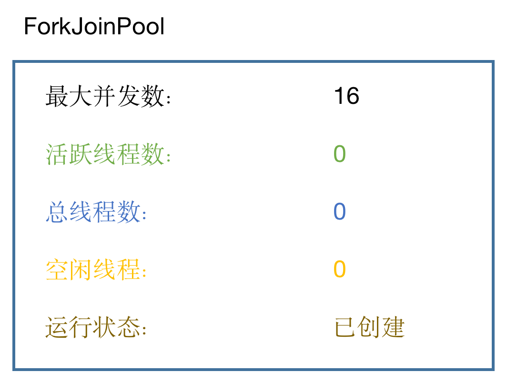

### 1.2 提交任务

当提交第一个任务后

```java
pool.submit(/*任务A*/);
```

过程和上一篇文章中说的一样，`ForkJoinPool` 会先初始化数组 `workQueues`，再把这个 任务A 提交到一个**偶数**索引中，然后创建并启动一个线程。

初始化数组这个动作必然是只有一个线程来完成，靠的就是 **运行状态** 字段，尝试初始化数组的线程都先会对 **运行状态** 字段进行一个 CAS，将这个字段替换成 **已锁定** 的状态，替换成功的线程才有资格创建 `workQueues` 数组。

```
运行状态： 已创建 -> 已锁定
```

当然创建完成后，会把 **运行状态** 修改为 **已启动**，来告诉其他线程，数组 `workQueues` 已经创建成了。

```
运行状态： 已锁定 -> 已启动
```

那 CAS 失败的线程呢？

则会通过原地循环或者挂起的方式等待 **已锁定** 状态的释放。

同样当前线程计算出一个偶数索引后，也需要对当前这个索引上的 `WorkQueue` 进行初始化，这个行为也是需要先把 **运行状态** 改为 **已锁定** 的！锁定和初始化 `WorkQueue` 过程我就不赘述了。

这一步的 CAS 如果失败的话，说明有另一个线程通过算法计算出的**偶数**索引和自己的发生冲突了，这个情况在源码里叫 `collision`，意为 **碰撞**，之后在部分场景中都有可能在并发环境下发生**碰撞**，这里大家先留个印象。

这里的碰撞 `ForkJoinPool` 是怎么处理的呢？失败的线程会修改自己本地的随机种子，然后再重新计算出一个新的**偶数**索引，目的肯定是希望新的索引不要产生碰撞（实际还是有概率会再次碰撞，这里不再展开）

而我们现在也仅仅只是创建出了 `WorkQueue`，还需要把当前的 任务A 提交到这个 `WorkQueue` 的 `top` 索引处，这个真正提交的过程，也是有可能发生**碰撞**的，这里就要给大家说明下 `WorkQueue` 还有哪些其他字段了

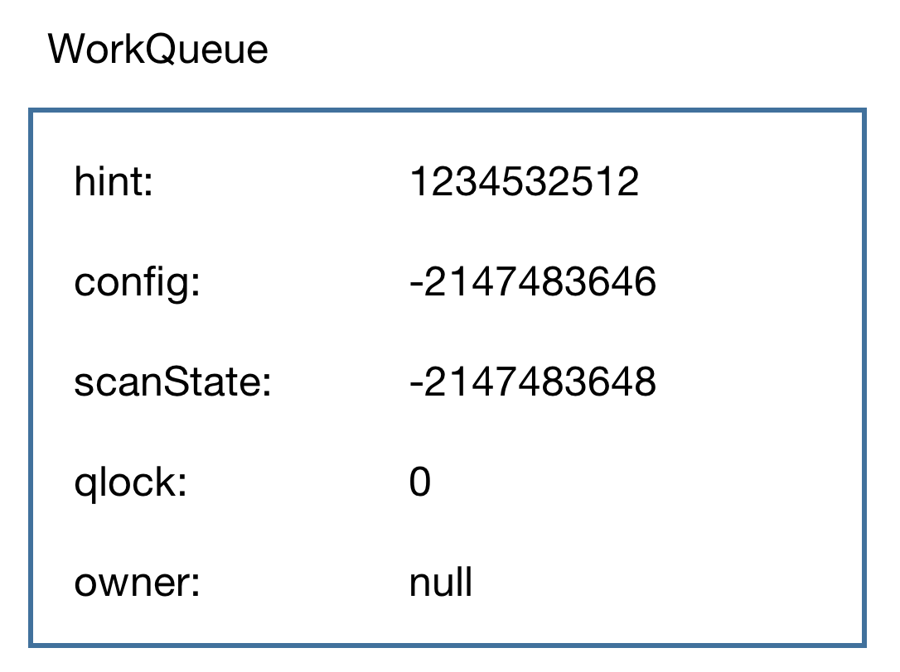

前 3 个字段大家上一篇已经打过照面了（数值我是 copy 上一篇中**偶数**索引的示例，大家只要还记得**偶数**和**奇数**不同就行），这次主要说说后两个字段：

- `qlock`： 0：无锁，1：有锁，-1：终止，并发安全就是通过 CAS 更新这个字段来保证的
- `owner`：当前的 `WorkQueue` 属于哪个线程，**偶数**索引的 `WorkQueue` 这个字段就是 `null`，**奇数**索引的则是指向那个和它一一绑定的工作线程，之后再聊

所以一个线程想要把任务提交到一个 `WorkQueue` 的 `array` 中去是必须要先获得这个 `WorkQueue` 的锁，也就是通过 CAS 把 `qlock` 字段从 0 修改为 1 的那个线程才视为获得了锁。

继续回到我们提交任务的场景，成功获取 `qlock` 的线程就可以对 `array` 进行赋值了，把任务放到 `top` 位置的索引处。

那获取 `qlock` 失败的线程呢？和刚才的情况是一样的，也会修改自己的随机种子，然后重新计算索引～

### 1.3 创建线程

啰里八嗦终于到重要部分了！要创建线程有三个条件：

- 当前 **总线程数** 必须要小于 **最大并发数**（我的示例中就是 16）
- 当前 **活跃线程数** 也必须要小于 **最大并发数**
- 当前 **空闲线程** 为 0

我在列举有哪些字段的时候，特意写的是 **空闲线程** 而非 **空闲线程数**，原因是 **空闲线程** 这个字段记录的并不是线程数量！具体记录什么，我之后再解释，大家先有个印象！

当同时满足以上 3 个条件后，才会尝试创建一个新的线程，之所以用了“尝试”二字，是因为 **最大并发数** 是有固定值的，而创建线程的时候也是可能产生并发的，所以又得靠 CAS 了！

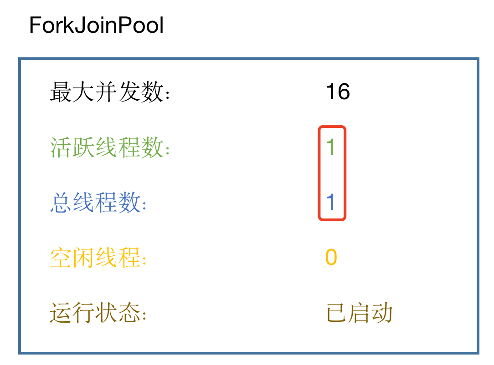

看哪个线程可以用 CAS 将 **活跃线程数** 和 **总线程数** 成功加上 1，即视为有资格创建工作线程，而 CAS 失败的线程将会重试修改（前提是上面三个条件仍然满足）

### 1.4 绑定 WorkQueue 并启动线程

上一篇我们提到过当线程对象被创建出来后，首先会基于它的一个随机种子，寻找到一个合法的**奇数**索引，那找到这个奇数索引的时候，会遇见两种情况：

- 这个索引为 `null`
- 这个索引已经存在 `WorkQueue`

首先无论两种情况中的哪一种，要做后续操作都要先将 `ForkJoinPool` 修改为 **已锁定**，然后我们再看这两种情况：

如果为 `null`，那直接创建一个 `WorkQueue` 即可，然后放入**奇数**索引即可，这和我们上一篇中的情况是一样的

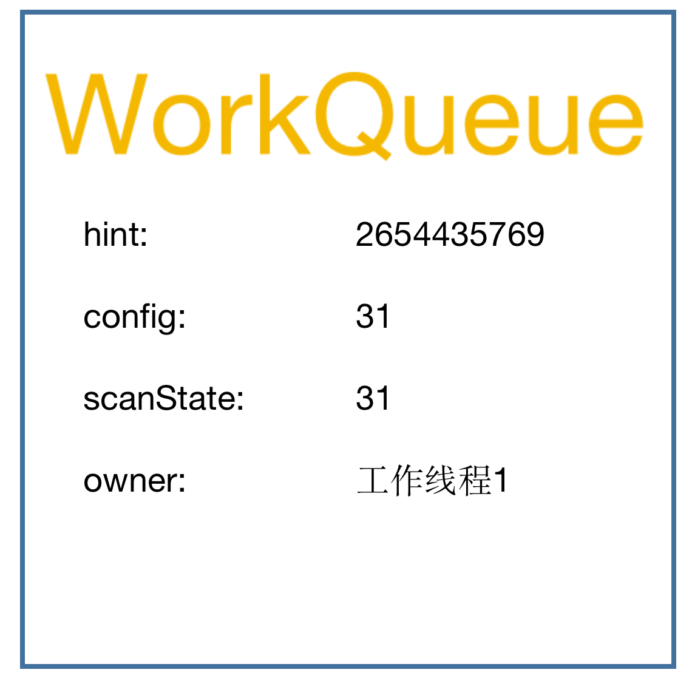

我这里多展示了 `owner` 字段（其他字段仍然以上一篇中的索引 31 举例）

如果这个**奇数**索引已经存在 `WorkQueue` 呢？因为对于**奇数**索引中的 `WorkQueue` 的 `owner` 字段的特殊性，必须指向唯一的线程，所以这里需要重新寻找一个奇数索引为 `null` 的位置，寻找的过程如下：

- 根据当前 `ForkJoinPool` 的 `workQueues` 数组的长度计算出一个步长 `step`
- 不断使用该 `step` 寻找下一个**奇数**索引，这时又有两种情况：
    - 找到了为 `null` 的**奇数**索引
    - 当前数组所有**奇数**索引均不为 `null`，那就对当前 `workQueues` 进行扩容，扩容策略为 2 倍长度数组，扩容完成后继续寻找（扩容完肯定是能找到的）

那么 `step` 是如何计算的呢？前面有提到过的 `workQueues` 数组最小长度实际是 4，所以常见的数组长度和 `step` 对应关系如下：

| 数组长度 | step |
| -------- | ---- |
| 4        | 2    |
| 8        | 6    |
| 16       | 10   |
| 32       | 18   |
| 64       | 34   |
| 128      | 66   |

除了 4 以外，其他就是除以 2 再加 2，这个公式别问怎么来的，问就是代码写死的，以我们示例中的数组长度是 32 的举例的话，`step` 就是 18。

那我现在假设和前文一样，第一次随机到的**奇数**索引还是 31，寻找过程是怎么样的呢？

| 寻找次数 | 索引 |
| -------- | ---- |
| 1        | 31   |
| 2        | 17   |
| 3        | 3    |
| 4        | 21   |
| 5        | 7    |
| 6        | 25   |
| 7        | 11   |
| 8        | 29   |
| ...      | ...  |
| 15       | 27   |
| 16       | 13   |
| 17       | 31   |
| ...      | ...  |
| 31       | 27   |
| 32       | 13   |

可以看到按照 `step` 顺序寻找索引，找到第 17 次其实已经回到最初的位置 31 了，但是仍然还需要再找一圈，当次数达到数组长度 32 的时候，就认为当前数组没有为 `null` 的**奇数**索引了，就会进行数组扩容。（至于为什么要寻找两圈，可能是因为在某些条件下，当工作线程退出时，与它绑定的 `WorkQueue` 所在的索引位置会被重新置为 `null`，相当于还了回去，所以找两圈就是尽可能的去找到为 `null` 的索引位置，从而避免数组扩容！）

找了两圈发现**奇数**索引均已满

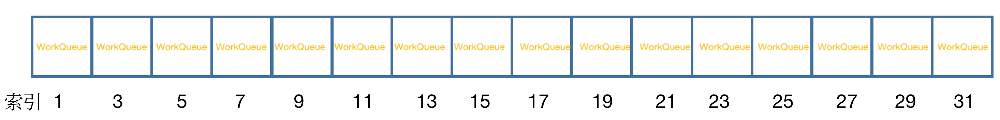

注：图中省略**偶数**索引

需要进行扩容，扩容为 2 倍的数组（示例中长度为 64）

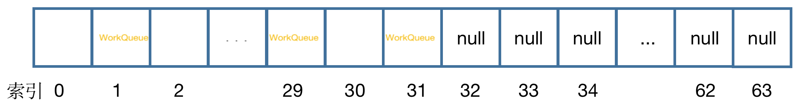

然后再在新的数组中继续寻找，最终会在索引 49 处找到为 `null` 的位置（31 + 18 = 49），然后和前面一样，创建一个 `WorkQueue` 就不再赘述了，而上面的整个绑定过程是建立在获取 `ForkJoinPool` 的锁的基础上的，所以是并发安全的。

线程绑定成功后，就可以启动线程了

### 1.5 工作线程寻找任务

工作线程寻找任务的流程上一篇文章已经说过了

- 通过随机数算出一个初始的随机索引位置
- 从该索引位置向后寻找被提交的任务
- 找到就从数组 `array` 中取出执行
- 找两圈还是找不到线程就挂起

这个流程的图我已经画过了，这里不再赘述。

这里我需要进一步讲解的是，当找到被提交的任务之后，从数组取出的操作，之前说过是通过 CAS 去保证并发安全的，那如果有多个线程同时找到了这个索引中被提交的任务，但是取出的时候只有一个线程成功了，失败的线程怎么办？

和之前碰撞的情况类似，`ForkJoinPool` 采用的都是重新生成一个随机数，然后重新算出一个初始的索引位置，重新开始寻找！（溜了溜了，打不过就跑，真乃三十六计走为上！佩服）


当找了两圈仍然一无所获的时候，线程就要挂起，这个时候，线程池 `ForkJoinPool` 是如何处理并记录的呢？

### 1.6 挂起工作线程

这里我先要引出在 `WorkQueue` 上的一个新字段 `stackPred`

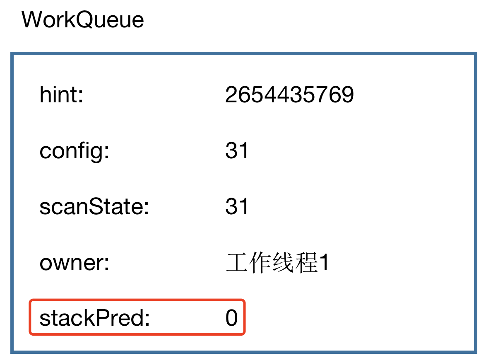

当准备挂起时，`WorkQueue` 首先会把 `scanState` 修改为 -2147483617，其实就是 `INACTIVE | 31`

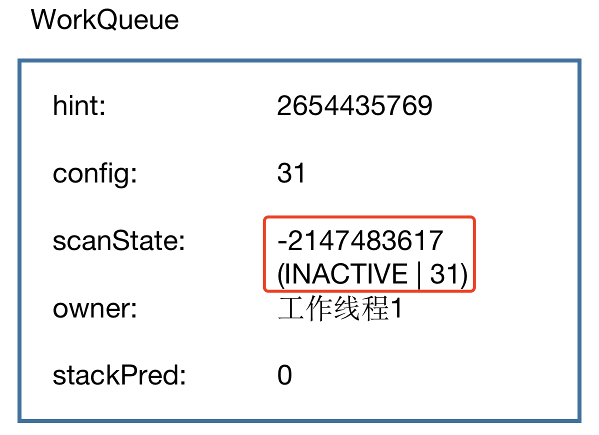

然后把 `stackPred` 修改为 0

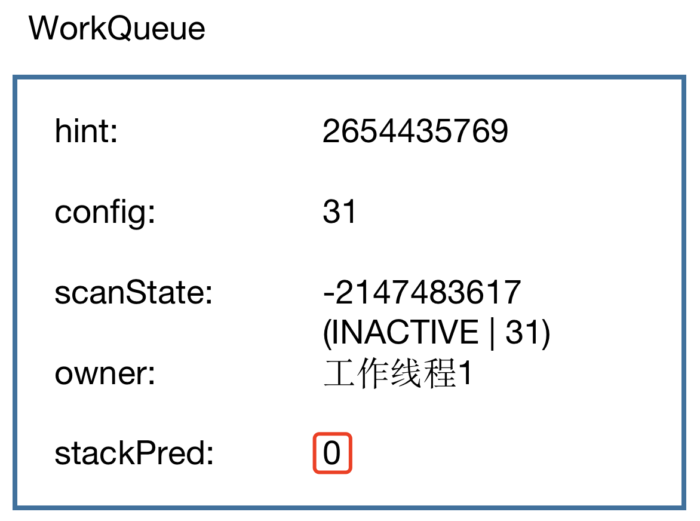

看到这里你肯定有疑问了，这 `stackPred` 本来不就是 0 吗？

你说的没错，虽然都是 0，但含义并不一样，前者 0 是初始值，后者 0 是当前这一时刻线程池的 **空闲线程** 字段！现在这个字段因为是 0 所以修改后的值才是 0，也就是说如果当线程池此时此刻的 **空闲线程** 字段不为 0 的话，这次的修改就有了意义。那么什么时候 **空闲线程** 字段会不为 0 呢？别急，这就解释。

修改完 `WorkQueue` 字段后，还需要修改 `ForkJoinPool` 的字段

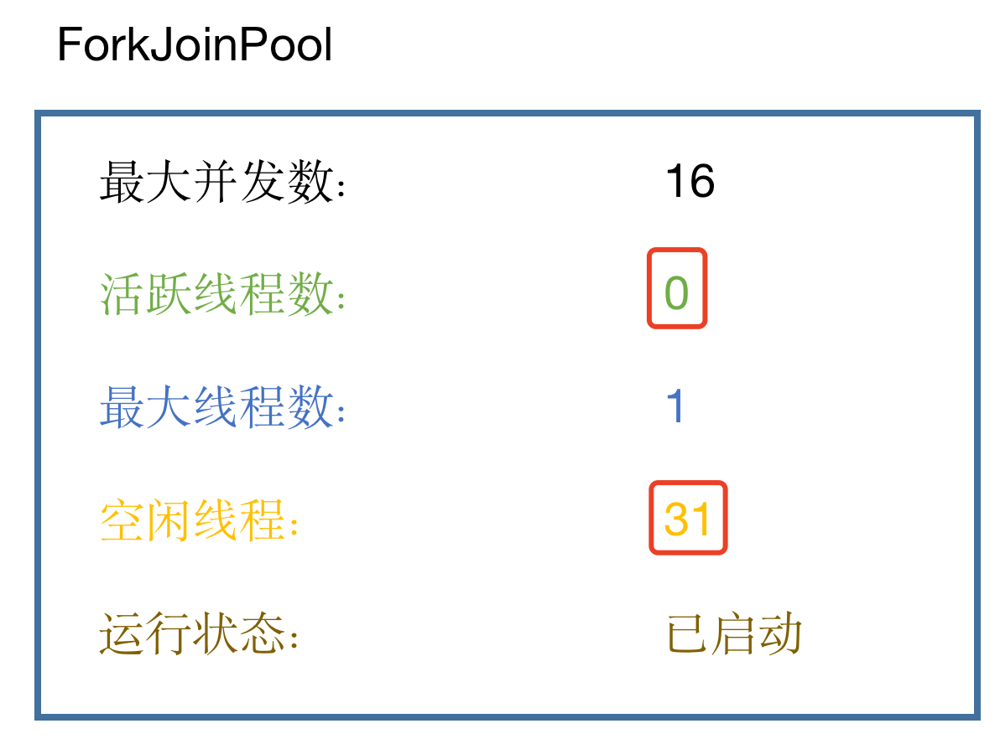

将 **活跃线程数** 减 1，将 **空闲线程** 修改为 31！修改这两个字段的时候也是通过 CAS 保证并发安全的

这里我可以跟大家解释 **空闲线程** 的含义了：指的是最后一个挂起的工作线程所绑定的 `WorkQueue` 的索引位置！

然后就是真正挂起的流程了，不再赘述。

### 1.7 唤醒工作线程

还记得我们前面提到创建线程的三个条件吗：

- 当前 **总线程数** 必须要小于 **最大并发数**（我的示例中就是 16）
- 当前 **活跃线程数** 也必须要小于 **最大并发数**
- 当前 **空闲线程** 为 0

当我们又提交了一个任务以后

```java
pool.submit(/*任务B*/);
```

还是先要检查上面三个条件，但是此时 **空闲线程** 不为 0 了，说明当前线程池中有挂起的空闲线程，所以不满足创建线程的条件！`ForkJoinPool` 被设计成当线程池中有挂起的线程，优先唤醒它们。

关于唤醒，上一篇文章我也已经说过了，所以这里不再赘述了。

## 二、继续深入

我们这一章又带大家过了一遍相对简单的流程，但是实际的情况往往会复杂非常多，我这里跳出之前的示例，开始给大家空降介绍一些更复杂的场景

### 2.1 从 空闲线程 再谈 stackPred

经过前一个小例子，你应该还无法理解 `WorkQueue` 的 `stackPred` 字段的用意，这里我凭空编造一个场景，`ForkJoinPool` 现在的状态是这样的：

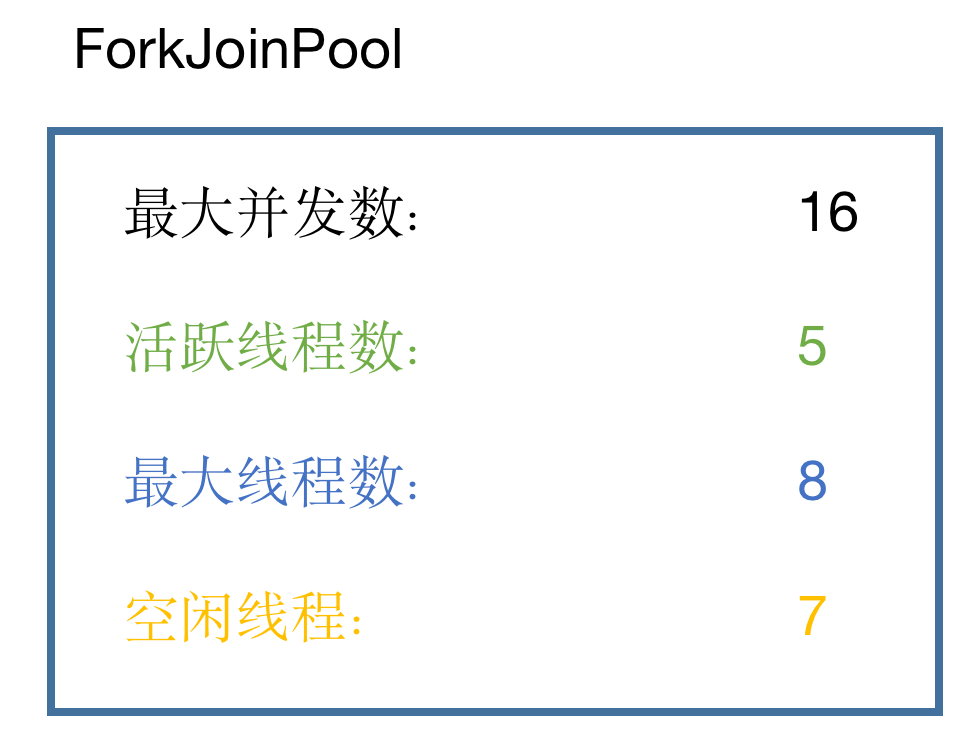

（注：图中我省略了 **运行状态** 字段）

当前线程池中共有 8 个线程，5 个正在运行，另外 3 个线程被挂起。

如果在这个状态下，外部又提交一个新的任务，整个流程又是怎么样呢？

虽然两个线程数字段都小于 **最大并发数** ，但是可以看到 **空闲线程** 是不为 0 的，所以这里不会创建新的线程，优先走唤醒流程。 

前文可知 **空闲线程** 记录的是最后一个挂起的工作线程所绑定的 `WorkQueue` 的索引位置，所以首先会找到索引 7 的 `WorkQueue` 假设是这样：

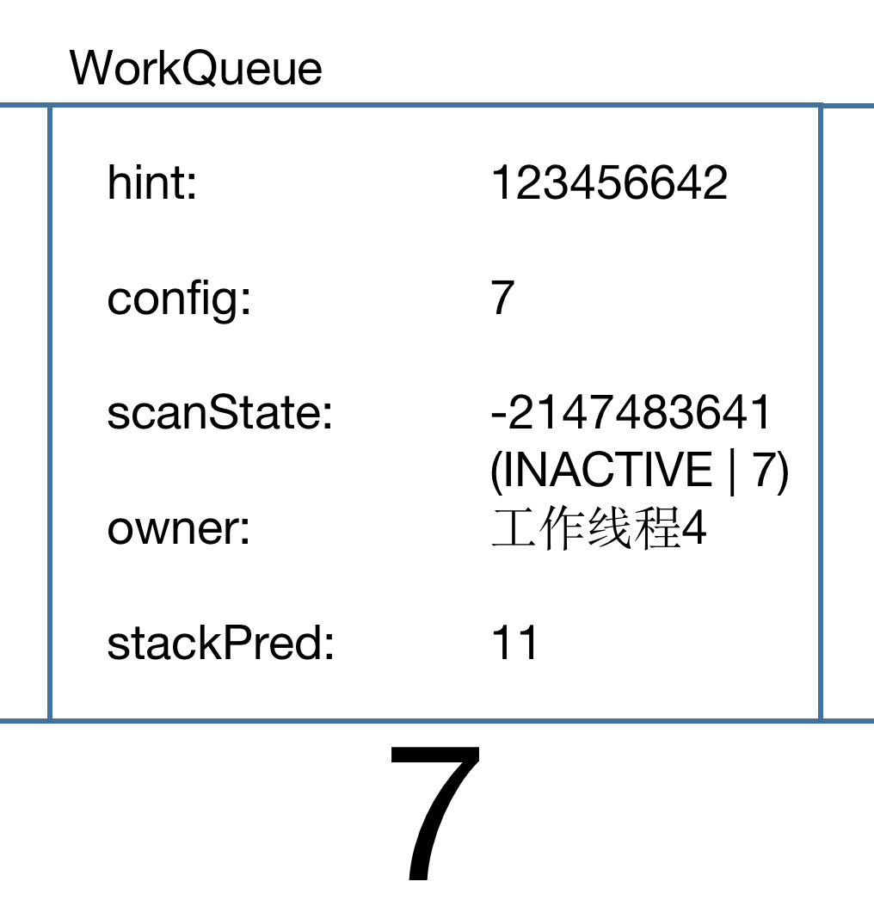

唤醒的话，先得修改 `ForkJoinPool` 的状态

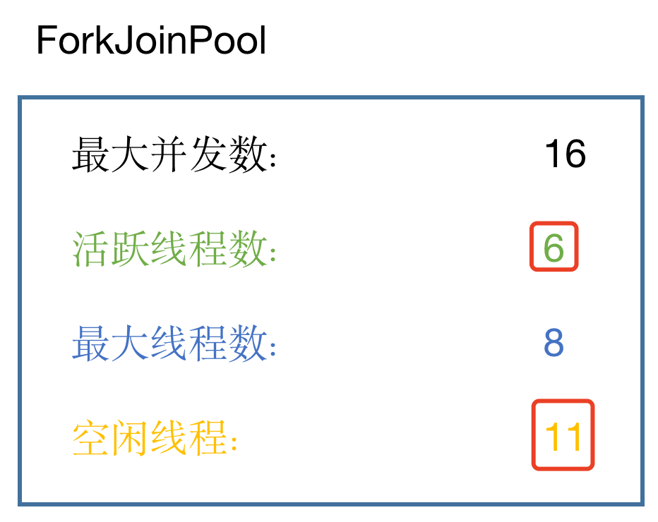

将 **活跃线程数** 从 5 修改为 6，**空闲线程** 从 7 修改为 11

11 这个数字是从索引 7 处的 `WorkQueue` 的 `stackPred` 来的

然后再把索引 7 的 `WorkQueue` 修改成这样

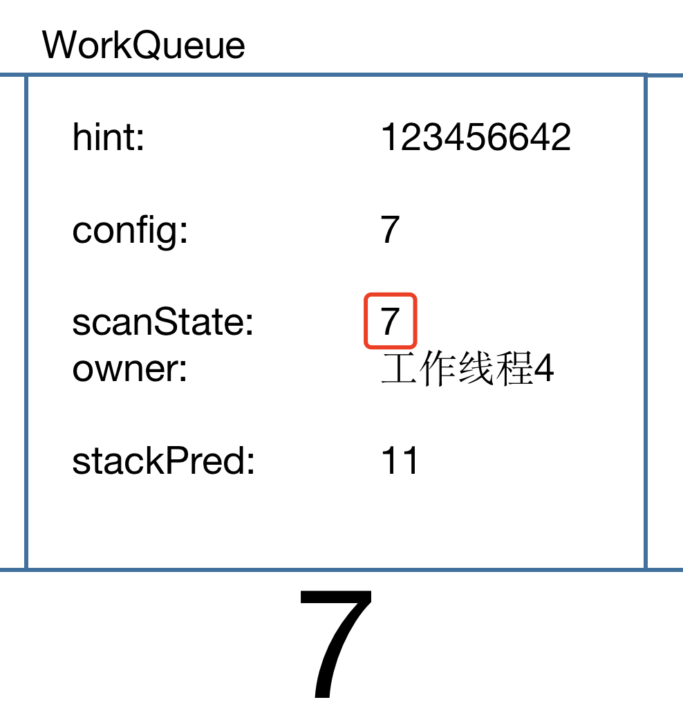

然后取出绑定的 **工作线程4** 唤醒即可！

那如果现在再提交一个任务呢？就会再唤醒一个线程，唤醒哪一个线程呢？没错，你一定知道了，这次唤醒的就是索引 11 的 `WorkQueue` 绑定的那个线程！说到这里你是不是好像有点明白了，我再画一些图，让这个过程更清晰！还是以三个线程挂起为例，假设是索引 1，索引 11， 索引 7 的三个线程，并且也按照 1 -> 11 -> 7 的顺序挂起

先挂起 1：

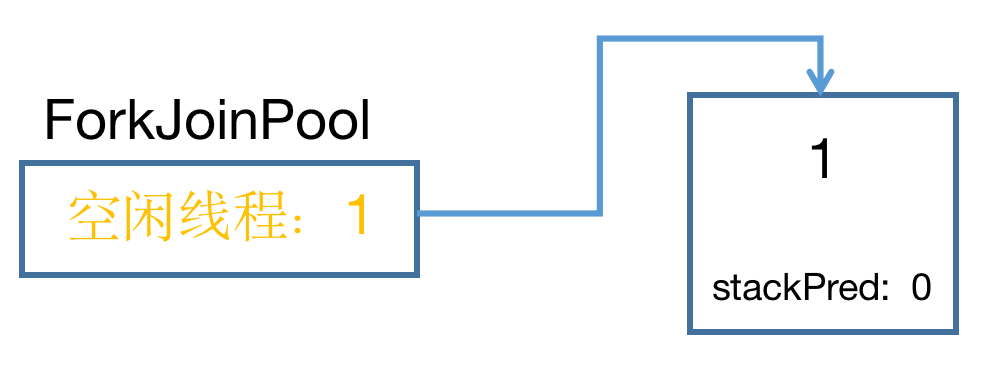

然后挂起 11:

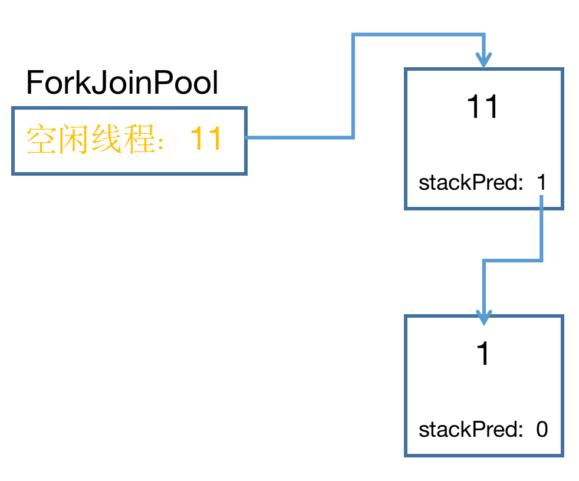

最后挂起 7:

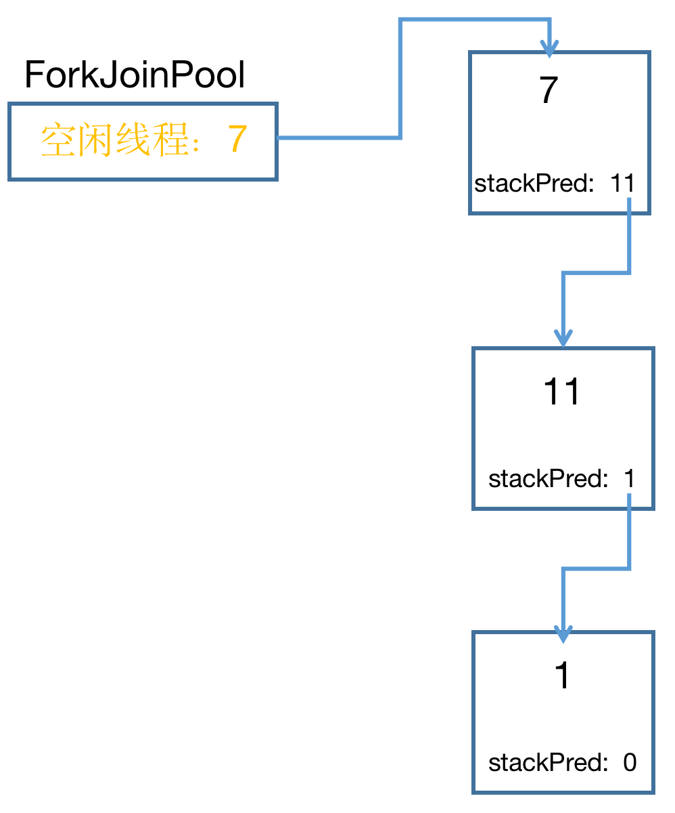

看到这里你是否明白了 **空闲线程** 这个字段的含义呢？这个字段相当于一个指针，指向最后一个挂起的工作线程所在的索引，每一个挂起的工作线程又通过 `stackPred` 字段记录着上一个挂起的工作线程（除了第一个，第一个挂起的线程记录 0 即可），而每一次唤醒则是从最后一个挂起的线程开始倒着向前。

```
挂起的顺序：1 -> 11 -> 7
唤醒的顺序：7 -> 11 -> 1
```

这样先进后出的顺序你想到了什么数据结构？没错，是 **栈**！那你现在是不是对 `stackPred` 字段名中的 `stack` 更有体会了呢？嘻嘻～

所以关于 **怎么知道有没有挂起的线程** 以及 **如何找到挂起的线程** 我来正式回答下：

- 查看 **空闲线程** 字段，只要不为 0 就说明当前有挂起线程
- **空闲线程** 字段记录的就是最后一个挂起的工作线程所在的索引

### 2.2 关于线程数字段

- 每创建并启动一个线程，**活跃线程数** 和 **总线程数** 加 1
- 每挂起一个线程，**活跃线程数** 减 1
- 每唤醒一个线程，**活跃线程数** 加 1
- 每退出一个线程，**活跃线程数** 和 **总线程数** 减 1

那下面要讲下什么时候线程会退出？一般来说可以总结为两种：

- 创建线程失败的时候
- 线程池被关闭的时候，此时所有线程都要退出

创建线程失败的话，因为线程都没有启动，所以只需要把上面两个**线程数**字段重新加 1 还回去即可。

既然聊到了关闭流程，那我们一起来看看线程池关闭流程时怎么样的吧？

## 三、 线程池关闭流程

我们之前大部分讨论的都是常规的正向流程（提交，寻找，执行任务）

当用户调用 `shutdown` 或者 `shutdownNow` 方法时，线程池会进行关闭

```java
pool.shutdown();
pool.shutdownNow();
```

这两个方法的区别是什么呢？

首先无论是哪个方法，一旦调用后就会把线程池的状态修改为 **已关闭**，修改完成以后如果还有提交任务的话，会直接报错

```
运行状态： 已启动 -> 已关闭
```

`shutdown` 会优先判断当前线程池中是否有正在运行的线程，即 **活跃线程数** > 0，如果有的话会立刻返回，不会强制关闭线程池，如果没有的话，则会把线程池状态修改为 **已停止**，而 `shutdownNow` 则会无视当前是否有正在运行的线程，直接也将线程池的状态修改为 **已停止**

```
运行状态： 已关闭 -> 已停止
```

到了 **已停止** 状态之后，就会开始遍历 `workQueues` 获取每一个不为空的 `WorkQueue`，然后把它的 `qlock` 修改为 -1，无论 `qlock` 之前是什么值（0 或 1），如果当前 `WorkQueue` 有挂起的工作线程，则唤醒它

因为每一个工作线程在寻找任务或者挂起的流程中，会判断 `qlock` 是否为 -1，如果是 -1 的话，就知道当前线程池已经关闭了，就会退出 `run` 方法，整个线程也就退出了

等将所有挂起的（或其他运行的）线程对应的 `qlock` 修改为 -1 后，最后将当前的线程池状态修改为 **已终止**，表示当前线程池彻底关闭了

```
运行状态： 已停止 -> 已终止
```

以上就是线程池关闭的大致逻辑了～

## 四、总结

现在可以来统一回答一部分之前的问题

- 如何启动线程对象
    - 答：当有任务提交至线程池中时
- 如何复用线程对象
    - 答：优先唤醒挂起的线程，线程池中的线程数量不会超过构造器中的最大并发数
- 如何保证并发安全
    - 答：CAS、CAS 还是 TMD CAS
- `ForkJoinPool` 有哪些字段记录一些状态，例如：总共有多少（活跃）线程
    - 答：最大并发数、活跃线程数、总线程数、空闲线程、运行状态等
- 怎么知道有没有挂起的线程
    - 答：通过查看 **空闲线程** 字段是否为 0
- 如何找到挂起的线程
    - 答：空闲线程 记录的是最后一个挂起的工作线程对应绑定的 `WorkQueue` 所在的索引位置
- `WorkQueue` 还有哪些没有说的字段
    - 答：`hint` 随机种子、`config` 最大并发数 + 所在索引、`scanState` 所在索引 + 状态、`owner` 绑定的工作线程、`stackPred` 上一个挂起的线程对应的索引
- 如何处理并发情况的（即有些 CAS 场景失败了会怎么样）
    - 答：有些会原地等待其他线程（`workQueues` 的初始化），有时会通过重置随机种子来尽可能避免**碰撞**

---

不知不觉又写了这么多，不过我还是得告诉大家一个坏消息，其实讲解到现在的原理仅仅是当 `ForkJoinPool` 作为一个普通线程池时的逻辑，我们并没有涉及到它的核心特色逻辑：`fork` 和 `join`！可是无奈这一篇文章又写了这么多，所以只能再拆分一期来讲解剩下的核心逻辑了～我们下一期就来回答：如何拆分和合并任务！

下期再见～

