# HelloForkJoinPool（四）—— 分分合合

正片开始，我们使用 `ForkJoinPool` 线程池就是因为它提供了拆分 `fork` 和合并 `join` 任务的能力，而我之所以不从一开始就和大家讲解这个话题，一方面是因为话题本身难理解（想多水几篇），另一方面也是希望大家对 `ForkJoinPool` 整体的数据结构和工作流程有了一定认识以后，再进入话题会更容易理解一点，下面我们将从基本使用开始直到讲解原理～

## 一、基本使用

`ForkJoinPool` 本身提供了很多种方式调用 `fork` 或 `join` 方法，下面我列举一下：

### 1.1 从主线程中调用

这里的 **主线程** 并非一定要是调用 `main` 方法所在的线程，只要不是在 `ForkJoinPool` 的**工作线程**中的就是这里所谓的主线程，示例代码还是以之前的 `SumTask` 举例

示例 1 （没有 `ForkJoinPool`）：

```java
SumTask task = new SumTask(1， 1000);
task.fork();
Long sumResult = task.join(); // 500500
```

示例 2 （没有 `ForkJoinPool`）：

```java
SumTask task = new SumTask(1， 1000);
Long sumResult = task.invoke(); // 500500
```

示例 3：

```java
ForkJoinPool pool = new ForkJoinPool();
SumTask task = new SumTask(1, 1000);
pool.submit(task);
Long sumJoinResult = task.join(); // 500500
```

示例 4:

```java
ForkJoinPool pool = new ForkJoinPool();
SumTask task = new SumTask(1, 1000);
Long sumJoinResult = pool.invoke(task); // 500500
```

---

你肯定会有疑问，1 和 2 根本就没有使用线程池，这个我之后再说，4 中的 `invoke` 实际就是将 3 中的 `submit` 和 `join` 合并了而已，只需要记得在调用 `join` 方法前必须要先提交至线程池（`submit` 或 `fork`）

### 1.2 从工作线程中调用

第一篇文章中我们就介绍过，用户要么自己继承 `ForkJoinTask` 要么继承另外两个更友好的 `RecursiveTask` 或 `RecursiveAction`（其实还有其他的 `class`，这里就不展开了）

一般来说，在下面的两类方法中去进行拆分和合并就是处在**工作线程**中了：

- `ForkJoinTask` 的 `exec` 方法
- `RecursiveAction` 和 `RecursiveTask` 的 `compute` 方法

我们还是以之前的 `SumTask` 的 `compute` 方法举例（省略了其他不相关的代码，下面也只演示了拆分成两个任务 `firstTask` 和 `secondTask`，理论上可以随意拆分成 N 个任务）

示例 1：

```java
@Override
protected Long compute() {
  	SumTask firstTask = new SumTask(start, middle);
    SumTask secondTask = new SumTask(middle + 1, end);
    firstTask.fork();
    secondTask.fork();
    return firstTask.join() + secondTask.join();
}
```

示例 2:

```java
@Override
protected Long compute() {
  	SumTask firstTask = new SumTask(start, middle);
    SumTask secondTask = new SumTask(middle + 1, end);
    firstTask.fork();
    return firstTask.join() + secondTask.invoke();
}
```

示例 3 （注意和 2 的区别）:

```java
@Override
protected Long compute() {
  	SumTask firstTask = new SumTask(start, middle);
    SumTask secondTask = new SumTask(middle + 1, end);
    secondTask.fork();
    return firstTask.invoke() + secondTask.join();
}
```

示例 4:

```java
@Override
protected Long compute() {
  	SumTask firstTask = new SumTask(start, middle);
    SumTask secondTask = new SumTask(middle + 1, end);
    invokeAll(firstTask, secondTask);
    return firstTask.join() + secondTask.join();
}
```

先说结论，最推荐 4 的写法，其次是 3（4 写法的底层就是 3，但代码面上最友好简洁），1 和 2 都是不推荐的写法，因为有坑，之后讲解了原理之后大家就知道坑在哪里了

---

是否从**工作线程**中调用，在背后的实现有着很大差别，下面我会从原理出发讲解 `fork`、`join`、`invoke` 三类方法的区别

## 二、正片开始

### 2.1 为什么可以不需要线程池

你是否有疑惑，从**主线程**调用的前两个示例中，我并没有创建线程池对象，任务为什么也能执行？

示例 2 中的 `invoke` 方法，实际就是使用当前线程进行单线程调用，之后的代码都要等待 `invoke` 返回才能被执行

在我们说示例 1 之前，我们先得知道一个叫 `common` 的东西，狗叔在设计 `ForkJoinPool` 的时候，设计了一个 `common` 字段，这个 `common` 是一个静态的字段在 `ForkJoinPool` 类中，当 `ForkJoinPool` 被加载的时候（`static` 代码块）进行初始化，就是一个全局性质的 `ForkJoinPool` 

```java
static final ForkJoinPool common;
```

所以之前的示例 1 可以不需要创建 `ForkJoinPool` 来进行任务的拆分执行，就是因为这些任务全部会被提交至这个 `common` 的线程池中去执行，之后我会称这个线程池为：**全局线程池**。

这个线程池的最大并发数默认为 CPU 核数 - 1，对于我的 MBP 来说是 15

### 2.2 fork

刚刚我们捋过情况了，无非就两种：在**主线程**中和在**工作线程**中。

#### 2.2.1 主线程

就是提交至**全局线程池**中，这个线程池和我们自己创建的线程池的流程没有任何区别：算出一个偶数索引 -> 放入该索引对应的 `WorkQueue` 的 `array` 中 -> 启动线程 等等，就不赘述了。

#### 2.2.2 工作线程

之前的文章中我们说过，每一个工作线程都会绑定一个处于**奇数**索引的 `WorkQueue`，这个 `WorkQueue` 也是拥有 `array` 数组的，只是里面没有任务罢了。而此时 `fork` 的任务则会被提交到该 `WorkQueue` 的 `array` 中去，而且此次提交都不需要 CAS 保证并发安全，因为工作线程内部的 `array` 只有自己能放任务，别的线程只能取任务，放完之后会尝试创建线程，逻辑不再赘述

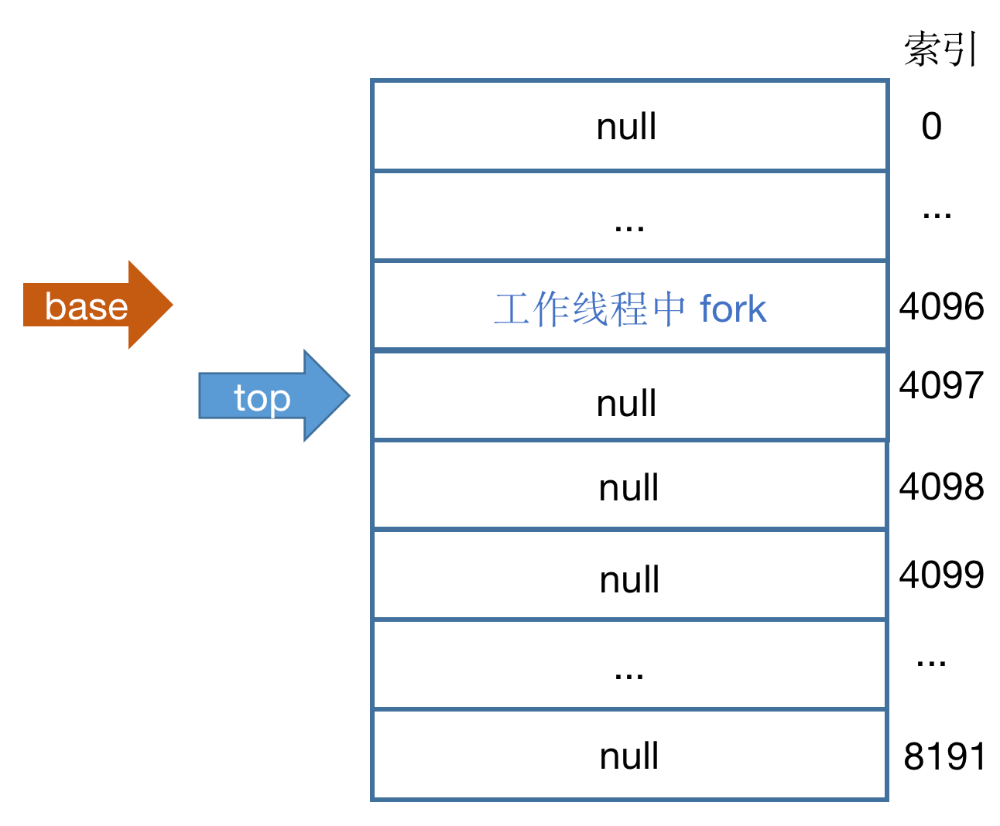

`fork` 的逻辑就是这么简单

### 2.3 invoke

`invoke` 比 `fork` 更简单， 刚刚说过 `invoke` 方法实际就是用当前线程（无关乎是否是**主线程**或**工作线程**）直接执行 `ForkJoinTask` 任务内容（比如示例中的 `SumTask` 的 `compute` 方法），我们这里暂时不讨论 `compute` 方法内是否会使用多线程。

### 2.4 join

这个方法才是重点中的重点，复杂程度比上面两个加起来都高出了几个数量级，同 `fork` 一样，`join` 也是要区分是否在主线程中的，处理方法会不一样。

在聊 `join` 的原理之前，必须先明确一个东西：

- `join` 是会阻塞的，在被 `join` 的任务执行完成之前，位于 `join` 之后的代码是不会被执行的
- 不管 `join` 在哪个线程上，`join` 阻塞的原因有且只有一个，就是等待该被 `join` 任务的完成，只要任务完成，就会退出 `join` 方法

在 `ForkJoinTask` 内部使用一个 `status` 字段来标记任务完成状态的

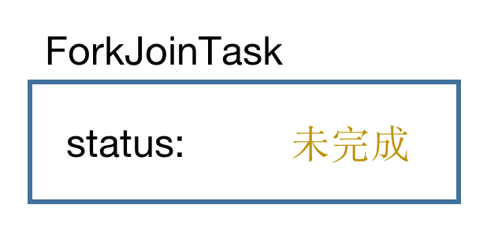

而任务的状态共有四种：**未完成**、**已完成**、**已取消**、**异常**，之后被 `join` 的任务我会称为**目标任务**。

#### 2.4.1 在主线程 join

我们刚刚说过，每一个 `ForkJoinTask` 要么被提交到**全局线程池**，要么就被提交到由用户创建的线程池。

如果位于主线程中 `join` 的话，此时会有两种情况：

- 任务已经执行完成
- 任务还未完成

如果已经执行完，自不必说那直接返回即可。

如果还未完成，当前线程则会尝试从**全局线程池中**取出该任务，之所以是“尝试”取出，是因为真正取出任务是要满足一些条件的，流程如下：

- 通过当前线程的随机种子计算出一个合法**偶数**索引，对应到**全局线程池**中的某一个 `WorkQueue`
- 这个 `WorkQueue` 必须存在，且它的 `array` 中必须有任务，且当前的被 `join` 的任务是位于该 `array` 的 `top - 1` 位置处 

满足上面的条件后，当前线程就会通过 CAS 的方式取出该任务，然后执行它并返回。

上面这段中的 `top - 1` 字眼非常别扭，我决定给它起个新的名字，之前在讲解线程池概述的时候，我有说过位于 `WorkQueue` 中的 `array` 是一个数组，但它实际逻辑上是一个队列，`base` 和 `top` 索引指针其实分别就是这个队列的出队和入队的指针，或者说是队首和队尾！

所以理论上 `top` 永远指向一个 `null` 的数组索引位置，而 `top - 1` 就可以理解为最近一个任务被放入的位置，而 `base` 永远指向一个任务（也有可能指向 `null`，说明队列为空），这个任务是该队列中被最早放入的。

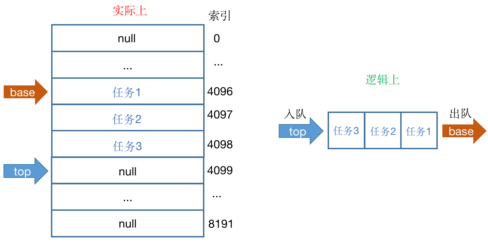

知道了这些以后上面的一段话可以被翻译成：如果当前被 `join` 的任务是位于该队列的**队尾**的话，则直接取出并执行。

当上面任意一个条件不满足的时候，也就是“尝试”取出失败的话，则会为该任务打上一个标记：**等待通知**，然后当前**工作线程**就会挂起

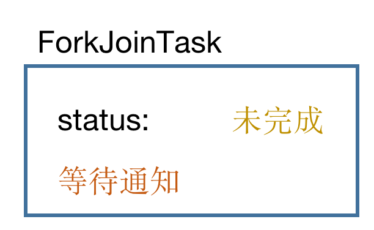

那这里我要对在之前的章节中讲解过的流程做一个补充，每当一个任务被执行完成后，首先会修改该任务的状态（图中以**已完成**举例，可能还有**已取消**和**异常**）

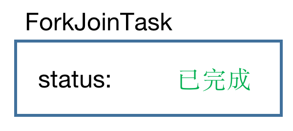

然后会查看该任务是否有**等待通知**的标记，如果有的话说明有其他线程正挂起在等待该任务的完成，此时就会通知所有等待的线程唤醒。

而被通知的线程唤醒后就会判断 `status` 字段，此时任务一定是终止的状态，然后就会返回

#### 2.4.2 在工作线程 join

这里我们只讨论当 `join` 任务**未完成**的情况

首先当前线程也会尝试取出该任务，只不过此时不再是从**全局线程池**中取出，而是从当前**工作线程**所绑定的 `WorkQueue` 的队列中（以下简称 **自己的队列**），同样也必须是该任务处于队列的**队尾**时，才能 CAS 取出并执行

如果此时尝试取出失败的话，情况就变得复杂了起来，一般会有以下几种情况：

- 1当前任务在**自己的队列**中，但是不在**队尾**

- 当前的任务压根不在**自己的队列**中，此时又会分为几种情况

    - 2该任务已经被其他线程执行完成，这时任务是已经被移除出了**自己的队列**（晚了一步）

    - 该任务的确不在**自己的队列**中，此时可能

        - 3在其他线程池中（可能是**全局线程池**，也可能是其他的线程池）

        - 4在同一个线程池，但在其他**工作线程**（奇数索引）的队列中

        - 5在同一个线程池，在其他的**偶数索引**的队列中

            

我接下来会一一来讲解每一个情况

情况 1：

当前**工作线程**会从**队尾**开始向**队首**寻找一遍，一直寻找到该任务

当寻找到该任务时，该任务必须处于**队首**或**队尾**

- 队尾：这个情况 1 不是说不在队尾吗？那有可能**尝试**取出的那时刻不在，到这里的时候可能就来到了**队尾**了，毕竟线程池面对的是一个并发的环境，此次寻找如果成功位于**队尾**的话，会和之前一样会直接 CAS 取出并执行该任务
- 队首：当发现该任务位于**自己的队列**中的**队首**时，会通过 CAS 将该任务取出并同时将一个代理的假任务替换回去，在源码里是 `EmptyTask` 类，这个任务类是空实现，什么都不会做（至于为什么要替换一个空实现任务，我也不清楚，我猜原因是不想修改 `base` 指针？）

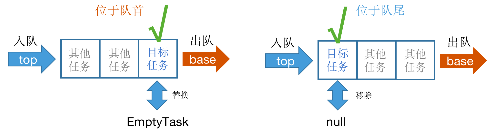

只要能成功取出（替换）该任务，就会执行它并返回

但当失败时：

- 无论是因为找到该任务时，它不在**队首**或**队尾**
- 亦或是因为 CAS 取出的时候失败（遭遇并发）

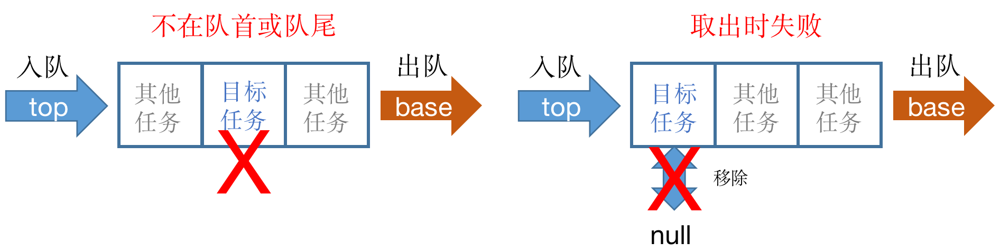

此时当前**工作线程**为了不让自己闲下来就会尝试下一个动作：窃取任务。

情况 2：

该情况通过查看字段 `status` 即可知道，当前目标任务已经被执行完成，直接退出 `join` 流程即可

情况 3、4、5：

和情况 1 一样会在**自己的队列**中寻找目标任务，但是用膝盖想也知道不可能能找到，那之后的情况和情况 1 中失败的场景是一样的，同样也会进入**窃取任务**的流程。

除了上面的几种情况，还有一种情况就是，**自己的队列**为空根本没有任务，也会直接进入**窃取任务**的流程！

### 2.5 窃取任务

在聊具体窃取逻辑前，我又需要对之前讲过的流程内容进行一个补充，每一个**奇数**索引对应的 `WorkQueue` 有一个字段 `currentSteal` 标记着当前索引对应的**工作线程**正在执行的 `ForkJoinPool` 任务

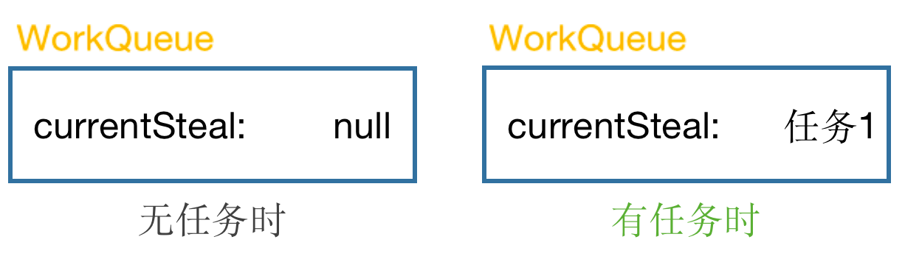

窃取任务的第一步是在当前**工作线程**所处的线程池中先找到目标任务所在的队列，寻找的步骤如下：

- 从自己（工作线程）所绑定的 `WorkQueue` 对应的索引开始，依次向后寻找所有的**奇数**索引的 `WorkQueue`
- 查看该 `WorkQueue` 的 `currentSteal` 任务是否是目标任务
- 整个寻找会遍历两遍（又是熟悉的两遍，狗叔很喜欢 double confirm 啊）
- 此时就两种情况：要么找到目标任务，要么遍历两遍了也没找到

图中省略偶数索引

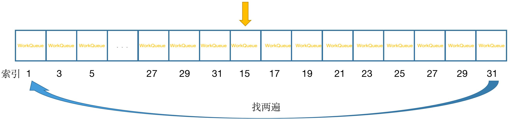

因为这次遍历寻找的条件是必须目标任务是处在 `currentSteal` 字段，如果能找到意味着目标任务正在被执行，可能不久之后就会完成了

#### 2.5.1 找到目标任务

先说说找到的话，会尝试从该 `WorkQueue`（这个 `WorkQueue` 也是有可能就是自己，这个 `WorkQueue` 我起名叫**被偷取队列**） 的队首处取出一个任务，如果取出成功的话就会把这个任务给执行掉，这一步是最接近字面上的 `steal` 窃取的，并且会临时把当前**工作线程**对应的 `currentSteal` 修改为这个任务

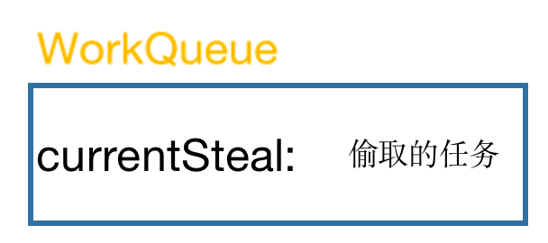

在这个执行偷取任务之前，会记录下**自己的队列**的**队尾**当前位置（即 `top` 指针的位置，我这里命名为 `frozenTop`）

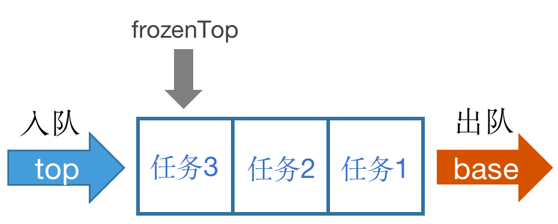

当这个偷取的任务被执行完成以后

- 如果目标任务仍然没有执行完成的话
- 并且在期间又有新的任务放入了**自己的队列**中（线程池本身就是并发环境），当前的 `top` 位置和上面记录的 `frozenTop` 的位置不一致

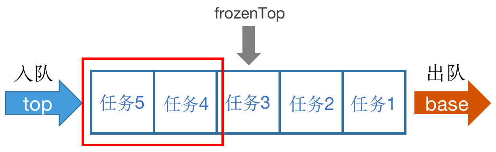

就会把**自己的队列**中的所有位于 `frozenTop` 之后放入的任务一个个取出并执行（图示中对应的就是 任务4、任务5）

这些全部执行完或者在期间目标任务已完成了的话，会把 `currentSteal` 改回原来的（图就不画了），以上的 从**被偷取队列**中偷取一个任务 + 清理**自己的队列**的所有新增任务，我这里把它们打包看成一次**窃取行为（1+N）**

在这之后，会查看**自己的队列**是否还有任务

- 有任务，会直接退出整个窃取任务流程（为什么有任务不继续执行，反而要退出？这里我也不太清楚，源码中也是仅仅用一句 `can't further help` 作为解释）
- 没有任务，会再进行一次**窃取行为（1+N）**

为什么盯着这个队列“偷”呢，我猜原因是因为这个队列是我们已知的那个正在执行我们**目标任务**的队列，它是腾不出手执行其他的任务，所以我们处于“道义（效率）”考虑帮下它

要记得整个窃取任务流程会因为 目标任务已完成 或者 **自己的队列**中有任务 而退出

#### 2.5.2 没有找到目标任务

找了两遍仍然没有找到，大概会有以下几种原因：

- 目标任务根本不在自己的线程池中，当然找不到
- 目标任务在自己的线程池中，但是在某一个**偶数**索引的队列中（之前的窃取任务寻找是只找**奇数**索引的）
- 目标任务在自己的线程池中的某一个**奇数**索引队列中，但是并没有被取出执行（即不在 `currentSteal` 字段）

狗叔在设计找的时候会统计路过的所有队列的 `base` 指针位置，这个统计的作用是想看看在寻找的过程中，整个线程池的状态是否是一个稳定的状态，所有的线程都在执行统计前在执行的任务，如果不是很理解也不要紧，就记住为了查看当前线程池是否是一个稳定的状态就行了，统计完无非就两种情况：

- 稳定：如果此时目标任务仍然是未完成的状态，就会退出整个窃取任务流程
- 不稳定：说明有任务被执行完成了，同时意味着有新的任务会被取出执行（也就是说有可能会将**目标任务**取出了）此时会回到窃取任务流程的一开始重新去遍历两遍当前线程池以寻找**目标任务**

### 2.6 尝试挂起

当退出窃取任务流程后，如果**目标任务**还是**未完成**的状态，此时就会尝试挂起，在决定挂起之前，也需要判断一些条件：

- 如果当前线程池有挂起的**工作线程**，则唤醒它，然后自己挂起
- **总线程数**是否达到了**最大并发数**
    - 达到了，此时将**活跃线程数**减 1，然后自己挂起
    - 未达到，创建一个新的线程，将**总线程数** 加 1，然后自己挂起
- 统计线程池中所有的**奇数**队列，是否都正在执行任务
    - 如果不是全部线程在忙，就不能挂起

挂起成功后就是等待**目标任务**执行完成后被唤醒了，但挂起失败的话会重新走一遍上面的整个 `join` 流程直到**目标任务**完成或者是线程挂起

### 2.7 小结

- 请记住唯一不变的是，在整个流程中会有很多地方判断**目标任务**是否**已完成**，只要**已完成**就会退出 `join` 流程
- 先找目标任务，找到如果在**队首**或**队尾**可以直接取出执行
- 尝试窃取任务（1 + N）以最大程度利用资源
- 任务未完成的最终归宿就是挂起线程

## 三、避免踩坑

现在 `fork` 和 `join` 的原理差不多讲完了，之前在 1.2 中我有说过 1 和 2 是不推荐的写法，我用这一章节来解释下为什么？

首先我这里先假设一个业务场景需要利用 `ForkJoinPool` 去完成，这个任务还是经典的求和，我这里要求 1 到 8 的相加的和，即 `1 + 2 + 3 + 4 + 5 + 6 + 7 + 8` 的和是多少？我这里为了简化场景，所以用了这个简单的例子

这个场景最理想的分而治之的流程应该是这样的，一分为二，再二分为四

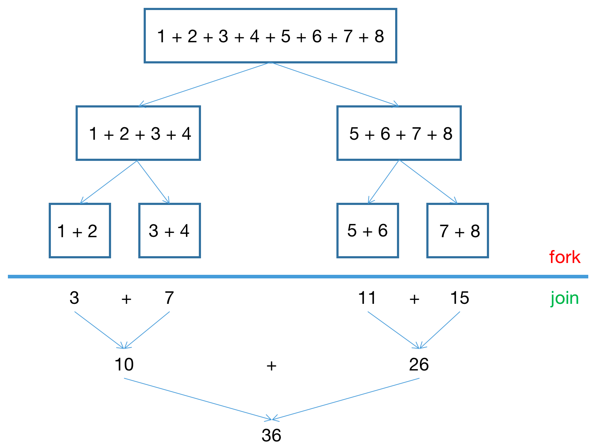

抛开提交总任务的主线程不说，当第一次 `submit` 任务（1 + 2 + ... + 8）后，线程池会创建一个线程，命名为 线程1

### 3.1 示例1 的问题

我们先来看看 1.2 中 示例 1 的写法会有什么问题（两个子任务都是 `fork`）

```java
@Override
protected Long compute() {
  	SumTask firstTask = new SumTask(start, middle);
    SumTask secondTask = new SumTask(middle + 1, end);
    firstTask.fork();
    secondTask.fork();
    return firstTask.join() + secondTask.join();
}
```

- 线程1 把任务拆成 1 + 2 + 3 + 4（线程2）和 5 + 6 + 7 + 8（线程3），并分别启动两个线程去处理
    - 线程2 将任务拆成 1 + 2（线程4）和 3 + 4（线程5），也启动两个线程去分别去处理
        - 线程4 计算 1 + 2 = 3 返回
        - 线程5 计算 3 + 4 = 7 返回
    - 线程2 获得返回并计算 3 + 7 = 10 返回
    - 线程3 将任务拆成 5 + 6（线程6）和 7 + 8（线程7），也启动两个线程去分别去处理
        - 线程6 计算 5 + 6 = 11 返回
        - 线程7 计算 7 + 8 = 15 返回
    - 线程3 获得返回并计算 11 + 15 = 26 返回
- 线程1 获得返回并计算 10 + 26 = 36 返回

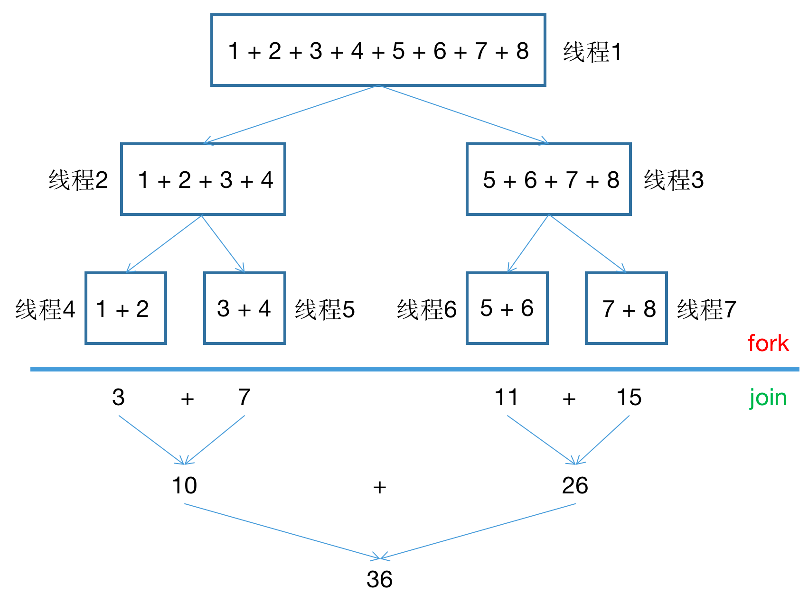

可以看到 示例1 的写法一共启动了 7 个线程（最多）去处理（看完原理你应该知道实际情况是可能是不需要 7 个线程的，这里就不继续展开了），线程1、2、3 拆分完任务就在原地等待了，造成了性能上的浪费，这就是 示例1 写法的坑，启动过多的线程，并且没有利用起多线程的资源

### 3.2 示例2 的问题

接下来看看 示例2 写法有什么问题

```java
@Override
protected Long compute() {
  	SumTask firstTask = new SumTask(start, middle);
    SumTask secondTask = new SumTask(middle + 1, end);
    firstTask.fork();
    return firstTask.join() + secondTask.invoke();
}
```

- 线程1 把任务拆成 1 + 2 + 3 + 4（线程2）和 5 + 6 + 7 + 8（线程1）
    - 线程1 继续将任务拆成 5 + 6（线程3）和计算 7 + 8 = 15（线程1）
        - 线程3 计算 5 + 6 = 11 返回
    - 线程1 计算 11 + 15 = 26 返回
    - 线程2 将任务拆成 1 + 2（线程4）和计算 3 + 4 = 7（线程2）
        - 线程4 计算 1 + 2 = 3 返回
    - 线程2 获得返回并计算 3 + 7 = 10 返回
- 线程1 获得返回并计算 10 + 26 = 36 返回

在之前的原理说过 `invoke` 方法是不会开启线程去执行的，所以相当于每一个线程都将一半任务提交出去交给其他线程，另一半任务自己本地做计算（当然被 `invoke` 的那一半任务仍然是可以继续 `fork` 的）

所以 示例2 的写法只用了 4 个线程就完成了这个功能，看起来好像没什么问题，那么坑在哪里呢？

示例2 是将 `firstTask` 进行 `fork` 的，`invoke` 的是 `secondTask` ，然后有问题的是这一句

```java
return firstTask.join() + secondTask.invoke();
```

之前说过 `join` 方法是阻塞的，在 `firstTask` 返回之前，后面的 `secondTask.invoke()` 是不会被执行的，这就造成了无谓的等待，这两半的任务明明是可以同时进行的，现在却变成了类似单线程，这样会严重影响性能，那要怎么改呢？直接改成下面这样就行了

```java
return secondTask.invoke() + firstTask.join();
```

改成这样就和 示例3 其实是一样的了

下面我分别测试下 示例2 和 示例3 的耗时，计算 1 至 100000000 的总和

```
示例2 耗时 5725 ms
示例3 耗时 172 ms
```

看到结果的巨大差异了吧？相差 33 倍

所以推荐直接使用 示例4 的写法，这样就不用搞清楚是到底是 `fork` 的哪个了，全部通过 `invokeAll` 提交就行

## 四、异常流程

前面提到了 `ForkJoinPool` 终止状态有三个：已完成、已取消、异常。这里我们来看看 已取消 和 异常 怎么样会被触发以及是如何处理的

### 4.1 已取消

之前我有提到过**工作线程**退出，现在需要对这个流程做一个补充，当**工作线程**退出时，会把**自己的队列**中的所有任务从队首一个个取出，然后执行取消操作

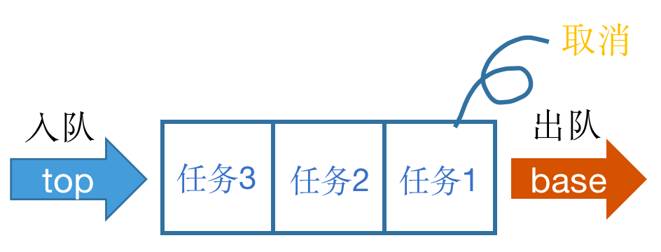

被取消的任务状态就会修改为 **已取消**。

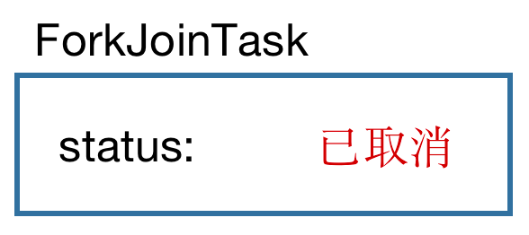

### 4.2 异常

异常的逻辑就相对复杂一点了，当我们自己的 `ForkJoinTask` 在处理业务逻辑的时候抛出异常的话，会被记录到一个全局的 异常数组 中，这个数组初始长度是 32 并且这个数组不会扩容

```java
private static final ExceptionNode[] exceptionTable;
```

这个数组的每一项是一个节点 `ExceptionNode`，同一个索引的节点构成一个单向链表，看到这里你想起了什么？没错，Java 中的 `HashMap` 就是这么个结构，只不过没有 key

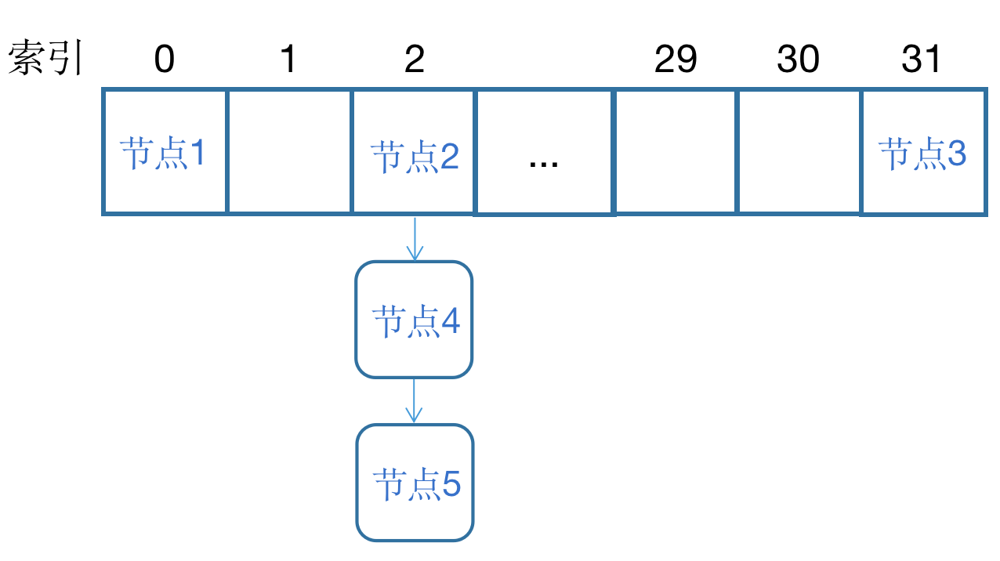

当一个任务抛出异常之后，会根据这个任务计算出一个哈希值，再根据这个哈希值计算出位于异常数组的一个合法索引，然后就是放入这个索引。

假设我这里有一个新的异常节点，计算出索引是 2

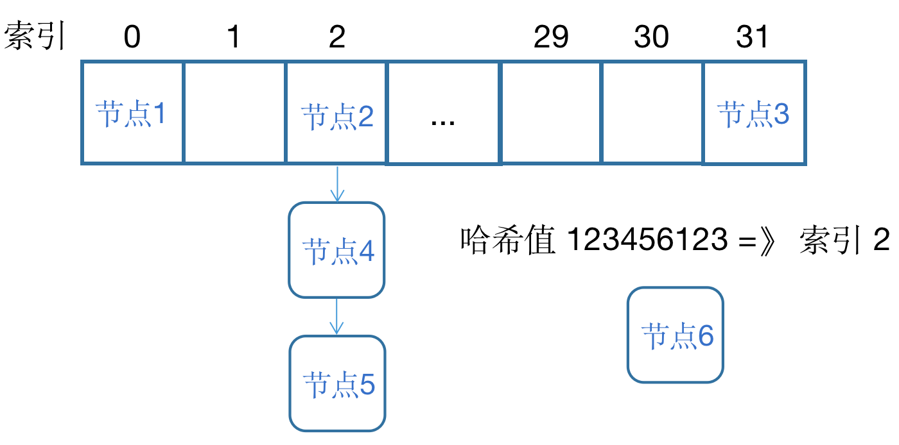

注：图中的哈希值我随便写的

因为索引 2 处已经有其他节点了，然后就沿着 next 指针往后找，直到找到 `null`，然后就将当前的异常包装成一个节点放入该索引处，也就是这个单向链表的头部

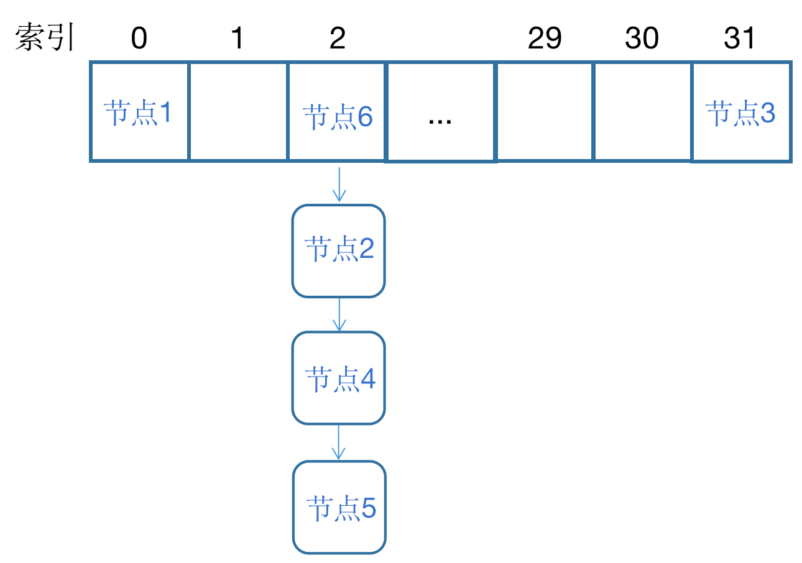

放入数组后，就会把该任务的状态修改为异常

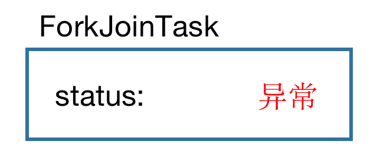

最后我再提一嘴，这个把实际异常包装起来的节点在源码中是弱引用对象 `WeakReference<ForkJoinTask<?>>`，关于弱引用这里就不展开了

然后 `ForkJoinTask` 是有获取异常的方法的

```java
sumTask.getException();
```

这个获取异常的方法首先会判断任务是 已取消 还是 异常，是 已取消 的话会获得 `CancellationException` 的异常，是真异常的话，则又会根据 调用获取异常方法的线程 和 抛出异常的线程 是同否为一个线程分两种情况：

- 是同一个线程的话，直接从 异常数组 中找出来返回即可
- 不是同一个线程的话，会通过反射使用该异常的构造器重新构造一个异常对象出来（我猜为了保证异常堆栈的正确性）

## 五、补充

之前第一篇文章里有说过 `ForkJoinPool` 构造器中有一个参数 `boolean asyncMode` 默认是 `false`，也就是同步模式，这个参数一直没有解释

那这里我要先补充一个流程，在每一个**工作线程**从线程池中寻找任务成功并执行这个任务完成之后，**工作线程**会清理一遍**自己的队列**中的所有任务，记住是所有任务！在这个时候，`asyncMode` 参数决定的是此时**工作线程**是从**队首**还是**队尾**处取出任务

- 同步模式（默认）：从**队尾**处取出，越早放入的任务越晚被拿出，源码里是 `LIFO`，即 先进后出
- 异步模式：从**队首**处取出，越早放入的任务越早被拿出，源码里是 `FIFO`，即 先进先出

## 六、总结

到这一篇文章结束，其实 `ForkJoinPool` 大部分的流程都已经涉及到并且梳理完成了，我这里做一个真正的提炼和总结：

- `ForkJoinPool` 是一个线程池，内部使用了一个数组来管理保存提交的任务
    - 数组分为了**偶数**索引和**奇数**索引，每一个索引对应了一个队列（数组）用来保存真正的任务
        - 偶数索引对应的是共享队列，负责保存从外部提交的任务
        - 奇数索引对应的每一个工作线程的私有队列，负责保存工作线程内部 `fork` 的任务
    - 每次提交任务后都会尝试新建线程来执行任务
        - 优先唤醒挂起线程来处理任务
        - 总线程数不会超过最大并发数
    - 工作线程会通过随机的方式从线程池中选择一个队列来获取任务
        - 期间尽可能避免冲突，若产生冲突了则尝试换一个队列
        - 如果没有可获取的任务，工作线程会选择挂起，等待唤醒
    - 工作线程在等待其他任务完成期间，会尝试从其他队列“偷取”任务来执行，已达到线程资源利用最大化
        - 实在没法利用资源，也会选择挂起，等待通知
    - 工作线程在执行完每一个任务后，会优先清空自己本地队列

---

我打算再用一篇文章的方式，使用真正的源码来解释下之前一些细小的点（放心，我不会贴大段大段的源码的），我们下期再见~

