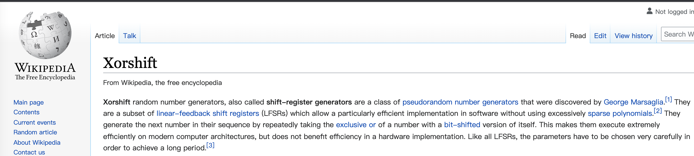

# HelloForkJoinPool（五）—— 原理补完

本篇是 `ForkJoinPool` 的最后一篇了，我会将之前文章中隐藏的一些细节，通过呈现源码的方式，给大家彻底讲一下。如果你是一看源码就会呕吐的人，那这一篇可能就不适合你了，不过还是感谢你可以点开本篇文章，你不看文章或许也可以拉到文章最后，看一看我最后想说的话~

## 一、了无秘密

### 1.1 偶数 还是 奇数

线程池工作中会有多处会有需要获得一个合法的 **偶数** 或者 **奇数** 索引，这是怎么做到的呢？

首先每一个线程会在自己本地生成一个**随机数**，再加上两个重要的 mask 就能获得一个**偶数**或者**奇数**的索引

还是以我的 MBP 为例，`workQueues` 是 32 长度的数组

第一个重要的 mask 就是 31（数组长度减 1），翻译成二进制就是

```
十进制：31
二进制：11111
```

任何一个数字和它做 ‘与’ 操作后，得到的一定是一个小于等于 31 的数字，这样就能得到一个合法的数组索引

第二个重要的 mask 就是 126 

```
十进制：126
二进制：1111110
```

因为它的二进制最后一位是 0，0 与上任何数都是 0，任何一个数字和它做 ‘与’ 操作后，结果的二进制最低位一定也是 0，最低位是 0 的数字一定是**偶数**

这个 `SQMASK` 就是**偶数** mask

```java
static final int SQMASK       = 0x007e;        // max 64 (even) slots
```

那**奇数**呢？源码中用的方法是

```java
(randomSeed << 1) | 1
```

任何数左移 1 位，再 ‘或’ 1，这样得到的结果最低位一定是 1，保证了结果一定是奇数

还有一个办法也是 ‘与’ 一个**奇数** mask

```java
static final int EVENMASK     = 0xfffe;        // even short bits
```

原理同 `SQMASK` 就不赘述了

### 1.2 随机数

每一个线程都会生成一个随机数，无非就是写一大段 **异或**、**位移** 等等，这里就不展开了，但是除了这个方式生成随机数以外，狗叔还用了一个叫 `xorshift` 的方式去生成随机数

```java
probe ^= probe << 13;   // xorshift
probe ^= probe >>> 17;
probe ^= probe << 5;        
```

这是维基百科的解释



**Xorshift** 随机数生成器，也称为**移位寄存器生成**[器](https://en.wikipedia.org/wiki/Pseudorandom_number_generator)，是[George Marsaglia](https://en.wikipedia.org/wiki/George_Marsaglia)发现的一类[伪随机数生成器](https://en.wikipedia.org/wiki/Pseudorandom_number_generator)。这个算法特点就是速度快。

### 1.3 线程池字段

之前文章中的 **总线程数**、**活跃线程数**、**空闲线程** 字段实际在源码中是一个字段 `ctl`

```java
volatile long ctl;
```

通过规划不同的二进制位，再加上位运算符达到一个字段存取多个字段的效果

还是以我的 MBP 举例（最大并发数是 16）`ctl` 字段的初始值是下面这样

```java
1111111111110000 1111111111110000 00000000000000000000000000000000
```

可以看到分为三个部分，从左到右是 **活跃线程数（AC）**、**总线程数（TC）**、**空闲线程（IDLE）**，这些是怎么来的呢？

我取得缩写名其实就是 ActiveCount、TotalCount 由来的（源码里也是这么起的）

#### 1.3.1 AC

```
1. 取最大并发数
十进制：16
二进制：0000000000000000000000000000000000000000000000000000000000010000（这里我特意把高位的 0 补齐）
2. 转负数
十进制：-16
二进制：1111111111111111111111111111111111111111111111111111111111110000
3. 左移 48 位
二进制：1111111111110000000000000000000000000000000000000000000000000000
4. 取最高 16 位
二进制：1111111111110000xxxxxxxxxxxxxxxxxxxxxxxxxxxxxxxxxxxxxxxxxxxxxxxx
```

#### 1.3.2 TC

基本和 AC 相同

```
1. 取最大并发数
十进制：16
二进制：0000000000000000000000000000000000000000000000000000000000010000
2. 转负数
十进制：-16
二进制：1111111111111111111111111111111111111111111111111111111111110000
3. 左移 32 位
二进制：1111111111111111111111111111000000000000000000000000000000000000
4. 取高 17 ~ 32 位
二进制：xxxxxxxxxxxxxxxx1111111111110000xxxxxxxxxxxxxxxxxxxxxxxxxxxxxxxx
```

至于 IDLE 就是 0，最后把这三部分 ‘或’ 一起就得到

```
AC:   1111111111110000xxxxxxxxxxxxxxxxxxxxxxxxxxxxxxxxxxxxxxxxxxxxxxxx
TC:   xxxxxxxxxxxxxxxx1111111111110000xxxxxxxxxxxxxxxxxxxxxxxxxxxxxxxx
IDLE: 0000000000000000000000000000000000000000000000000000000000000000			
------------------------------------------------------------------------
ctl:  1111111111110000111111111111000000000000000000000000000000000000
按三部分分割下就是上面的
ctl:  1111111111110000 1111111111110000 00000000000000000000000000000000
```

那么这么记有什么用呢？

线程池每添加一个线程都会为 AC 和 TC 部分分别加上 1

```
ctl:  1111111111110000 1111111111110000 00000000000000000000000000000000
+     0000000000000001 0000000000000001 00000000000000000000000000000000
-------------------------------------------------------------------------
ctl:  1111111111110001 1111111111110001 00000000000000000000000000000000
```

假设一直加到 15 个线程就会变成这样

```
ctl:  1111111111111111 1111111111111111 00000000000000000000000000000000
```

如果再加一个线程（第 16 个线程）会变成什么样呢？

```
ctl:  1111111111111111 1111111111111111 00000000000000000000000000000000
+     0000000000000001 0000000000000001 00000000000000000000000000000000
-------------------------------------------------------------------------
ctl:  0000000000000001 0000000000000001 00000000000000000000000000000000
```

由于进位的关系，整个 `ctl` 就会翻成正数（因为最高位符号位是 0），源码里是这么判断的，只要 `ctl` 小于 0，就可以尝试添加线程

```java
while ((c = ctl) < 0L) {                       // too few active
  	...
```

一旦翻成正数了，就不会添加线程了，因为此时线程池中的线程数已经来到了 16 个线程，达到了最大并发数了，妙啊

光看 AC 部分还是不够的，所以源码中还有段是这么判断的，就是看 TC 部分（仅仅那 16 位二进制）最高位是否是 1

```java
if ((ctl & ADD_WORKER) != 0L)            // too few workers
		tryAddWorker(c);
```

而 `ADD_WORKER` 就是

```java
private static final long ADD_WORKER = 1L << 47;
二进制： 0000000000000000100000000000000000000000000000000000000000000000
```

而至于 IDLE 部分的话，源码中是直接通过强转成 `int` 来获取的，强转成 `int` 以后就获得了低 32 位了

```java
if ((sp = (int)c) == 0) {                  // no idle workers
  	...
```

这里判断是否为 0 来判断是否有挂起的线程需要唤醒，所以这三部分如果串起来的话，代码块长这样

```java
while ((c = ctl) < 0L) {                       // 活跃线程数 小于 最大并发数
    if ((sp = (int)c) == 0) {                  // 为 0，说明没有 挂起的线程
      if ((c & ADD_WORKER) != 0L)            // 总线程数 小于 最大并发数
        tryAddWorker(c);
      break;																
    }
  	...
    // 下面是唤醒流程
```

那最后再说下为什么这三个字段要放在一个 `long` 类型的字段里（显得高端？大佬不会仅仅为了显得高端而用的），因为 `ForkJoinPool` 本身就是一个底层的工具，作为底层的工具是不可能有太多的其他依赖的，所以整个线程池要保证并发安全的话，只能依靠 CAS，但是 CAS 一次只能确保一个字段的更新，所以就要通过这种手段把多个字段放在一个字段中来保证并发安全，同样类似的在 JUC 中还有读写锁（读锁和写锁也是写在一个 `int` 字段中的）

## 二、源码阅读后感

没想到一个“小小”的 `ForkJoinPool`，竟然也能让我写 5 篇文章，文章内容还是隐藏了很多实现的细节，所以真正要搞懂它的原理：无他，为多读源码尔~

但是狗叔的代码风格实在是太粗犷了，阅读起来讲道理是真的吃力，我这里还是要吐槽一下，如果没有狗叔的实力，在公司写出这样的代码绝对要被喷死的。

### 2.1 CAS

这个放在第一个，毋庸置疑是整个对象最重要的，Java 代码中的 CAS 都需要依靠 `Unsafe` 这个类去完成，这里用到的这个类的一些方法我列下：

```
compareAndSwapXxx // CAS 方法
getXxx // 直接获取对象（通过内存地址）
putXxx // 直接设置值（通过内存地址）
```

源码中位于 `WorkQueue` 中的 `array` 数组，在取出任务或者存放任务的时候就用到了这些方法，而不是用类似 `array[index]` 的方式来操作的

### 2.2 synchronized

源码中用到了 `synchronized` 关键字都不是需要保证并发安全，而是为了用 `wait` 和 `notify` 来达到挂起和唤醒的机制

示例代码：

```java
synchronized (this) {
    if (status >= 0)
      wait(ms);
    else
      notifyAll();
}
```

### 2.3 代码风格

最令人抓狂的就是狗叔的 **单字母变量** 以及 **赋值加判断二合一** 以及 大量的基于二进制位移或者‘与’、‘或’等操作 等操作了

举例：

```java
WorkQueue[] ws; WorkQueue q; int rs, m, k;
...
if ((q = ws[k = r & m & SQMASK]) != null)
```

相对比较好的是，狗叔的 单字母变量 命名基本是固定的，熟悉之后，阅读障碍骤减

而且整个 `ForkJoinPool` 的功能相对来说是高内聚的，功能点主要就集中在  `ForkJoinPool` 和 `ForkJoinTask` 中，不用在不同类之间跳来跳去

### 2.4 疑问

我阅读代码中碰到过至今还是觉得是狗叔是不是写错了的片段，下面列出来大家评一评（源码细节我会忽略不重要的）

```java
// ForkJoinPool line 2410
final void externalPush(ForkJoinTask<?> task) {
  	...
  	if (...) {
      	// 当前的数组 workQueues 已经初始化，计算出的偶数索引也已经初始化
    		if (... (n = (s = q.top) - q.base)) {
      			...
            // 执行到这里这里任务已经放入成功了
      			if (n <= 1) // XXX 我觉得问题就出在这个 if 条件 n <= 1
              	// 通知线程（可能是唤醒工作线程 或 新增一个工作线程）
        				signalWork(ws, q);
      			return;
    		}
    		...
  	}
  	...
}
```

我来说下我的疑惑，变量 `n` 是由 `top - base` 得到的，根据我们之前的文章可以知道 `top` 是入队指针，`base` 是出队指针，两者相减得到的 `n` 相当于是这个队列中任务的数量，那这个 `if` 条件 `n <= 1`，就可以解读为 **队列中的任务数量小于等于 1，则通知线程** ，这是为什么呢？难道不应该是 `n >= 1` 才合理吗，大家觉得呢？

和上面一样，还有一段代码

```java
// ForkJoinPool line 870
final void push(ForkJoinTask<?> task) {
    ...
    int b = base, s = top, n;
      ...
      if ((n = s - b) <= 1) { // n = top - base，而条件也是 <= 1，我感觉也是写反了
        	...
          p.signalWork(p.workQueues, this);
      }
    ...
}
```

---

## 三、总结

差不多关于 `ForkJoinPool` 原理解析大部分我应该都已经涉及到了，我开始整理的时候也没想到，讲解一个 `class` 竟然也需要写五篇文章，狗叔的代码太粗犷了呀~ Orz

最后还是感谢大家能看到这里，我以前的文章也喜欢通过贴大段大段的源码来讲解原理，我觉得我以后都不会这么去讲解原理了，因为贴源码是最没有技术含量，也是最劝退的一种讲解方式，能给到读者的帮助很小（除非读者自己是看过源码的，而源码讲解正好帮助到他可能没有理解的那部分），下一个系列我也在酝酿了。

2021 年对我来说也算是充满变化的一年了，在 2021 的年初我自己也不会想到这一年会是这么个路线，最后分享给大家我最近很喜欢的两句话：

- **永远要相信明天会比今天过的更好**
- **接受不能改变的，改变可以改变的**

与君共勉~


